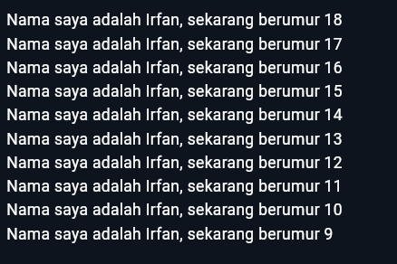

# Pertemuan 2: Pengantar Bahasa Pemrograman Dart - Bagian 1


|Nama|Muhammad Irfan Nur Hakim |
|----------------|--------------------------|
|Kelas          |TI-3F  |
|Absen          |`15`|


## Soal 1
```dart
void main() {
  for (int i = 18; i > 8; i--) {
    print('Nama saya adalah Irfan, sekarang berumur ${i}');
  }
}
```


## Soal 2
Mengapa sangat penting untuk memahami bahasa pemrograman Dart sebelum kita menggunakan framework Flutter ? Jelaskan!
> Karena bahasa pemrograman dart itu sebagai fondasi untuk membantu kita dalam pemrograman mobile dengan framework flutter, dimana dasar dart seperti mempelajari tipe data dan operator bawaan Dart, lalu bagaimana bekerja dalam pemrograman berorientasi objek (OOP) akan memudahkan kita nantinya saat membangun sebuah software mobile.

# Soal 3
Rangkumlah materi dari codelab ini menjadi poin-poin penting yang dapat Anda gunakan untuk membantu proses pengembangan aplikasi mobile menggunakan framework Flutter.
* Sejarah Dart
  > Diluncurkan pada tahun 2011, Dart telah berkembang sejak saat itu. Dart merilis versi stabilnya pada tahun 2013, dengan perubahan besar termasuk dalam rilis Dart 2.0 menjelang akhir 2018. Awalnya berfokus pada pengembangan web, dengan tujuan utama menggantikan JavaScript, sekarang telah fokus pada mobile development, termasuk framework Flutter.
* Pengenalan Dart
  > Bahasa Dart adalah inti dari framework Flutter. Dasar-dasar bahasa Dart dapat membantu kita dalam mendevelop perjalanan Flutter kita. Dart bertujuan untuk menggabungkan kelebihan-kelebihan dari sebagian besar bahasa tingkat tinggi dengan fitur-fitur bahasa pemrograman terkini. Dart mengeksekusi kode program dengan dua cara yaitu Dart virtual machines (VMs) itu untuk development Mobile dan JavaScript compilations itu untuk development Web

* Kelebihan Dart
  > * Productive tooling: merupakan fitur kakas (tool) untuk menganalisis kode, plugin IDE, dan ekosistem paket yang besar.
  > * Garbage collection: untuk mengelola atau menangani dealokasi memori (terutama memori yang ditempati oleh objek yang tidak lagi digunakan).
  > * Type annotations (opsional): untuk keamanan dan konsistensi dalam mengontrol semua data dalam aplikasi.
  > * Statically typed: Meskipun type annotations bersifat opsional, Dart tetap aman karena menggunakan fitur type-safe dan type inference untuk menganalisis types saat runtime. Fitur ini penting untuk menemukan bug selama kompilasi kode.
  > * Portability: bahasa Dart tidak hanya untuk web (yang dapat diterjemahkan ke JavaScript) tetapi juga dapat dikompilasi secara native ke kode Advanced RISC Machines (ARM) dan x86.

* Struktur bahasa Dart
  > - **Object orientation:** Dart dirancang untuk object-oriented (OO) yang didasarkan pada konsep objek yang menyimpan kedua data (disebut 'fields') dan kode (disebut 'methods'). Objek-objek ini dibuat dari cetak biru yang disebut 'class'. 
  > - **Dart operators:** Di Dart itu operator tidak lebih dari method yang didefinisikan dalam class dengan sintaks khusus.
  > - **Arithmetic operators:**
  >   - `+` (addition/tambahan)
  >   - `-` (subtraction/pengurangan)
  >   - `*` (multiplication/perkalian)
  >   - `/` (division/pembagian)
  >   - `%` (modulus/sisa bagi )
  >   - `-expression` untuk negasi (yang membalikkan suatu nilai).
  > - **Comparison operators:**
  >   - `==` (equality)
  >   - `!=` (inequality)
  >   - `>` (greater than)
  >   - `<` (less than)
  >   - `>=` (greater than or equal to)
  >   - `<=` (less than or equal to)
  > - **Logical operators:**
  >   - `!expression` negasi atau kebalikan hasil ekspresi—yaitu, true menjadi false dan false menjadi true
  >   - `&&` (operasi logika AND antara dua ekspresi.)
  >   - `||` ( operasi logika OR antara dua ekspresi.)
  > - **Increment and decrement operators:**
  >   - `++var` atau `var++` (increment/menambah nilai variabel var sebesar 1)
  >   - `--var` atau `var--`(decrement/mengurangi nilai variabel var sebesar 1)

