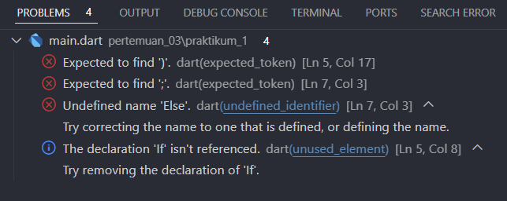
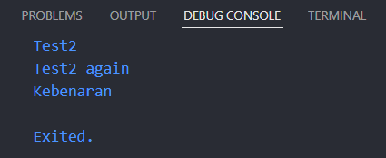
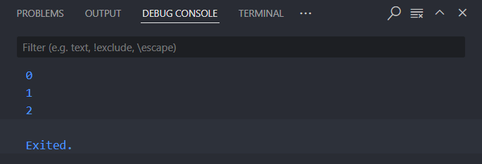
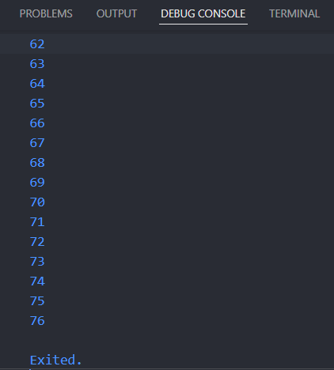
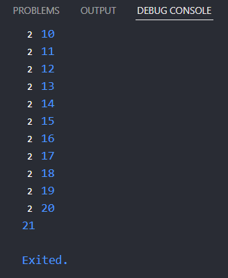
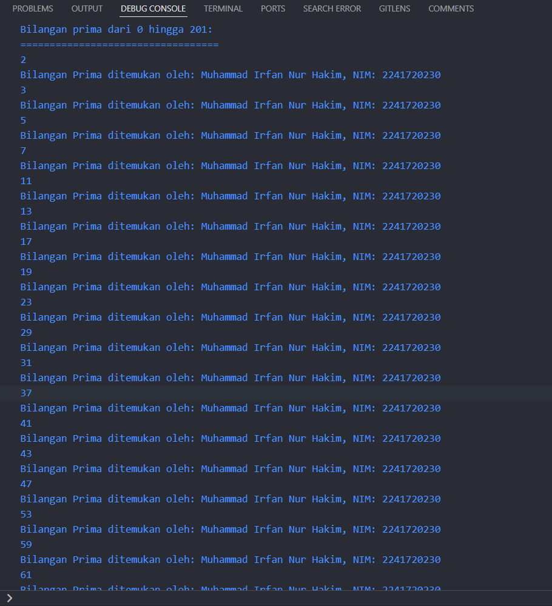

# Pertemuan 3: Pengantar Bahasa Pemrograman Dart - Bagian 2
|Nama|Muhammad Irfan Nur Hakim |
|----------------|--------------------------|
|Kelas          |TI-3F  |
|Absen          |`15`|
## Praktikum 1: Menerapkan Control Flows ("if/else")
---
### Langkah 1
```dart
void main() {
  String test = "test2";
  if (test == "test1") {
    print("Test1");
  } else If (test == "test2") {
    print("Test2");
  } Else {
    print("Something else");
  }

  if (test == "test2") print("Test2 again");
}
```
* Berikut setelah di run akan error


### Langkah 2
Silakan coba eksekusi (Run) kode pada langkah 1 tersebut. Apa yang terjadi? Jelaskan!
> Hal yang terjadi yaitu error, karena penulisan huruf besar kecil pada if else tersebut. Sebab bahasa dart itu case sensitive.

* Berikut hasil kode program setelah diperbaiki:


### Langkah 3
Tambahkan kode program berikut, lalu coba eksekusi (Run) kode Anda.
```
  String test = "true";
  if (test) {
    print("Kebenaran");
  }
```
> Jika kita menambahkan kode program tersebut, Maka yang terjadi akan error karena terdapat duplikasi pada pendefinisian variable test nya dan true itu pada tipe data boolean. Cara agar tidak terjadi error yaitu mengganti tipe data String menjadi boolean dan nama variabel test menjadi testBoolean, seperti kode program berikut: 

```
void main() {
  String test = "test2";
  if (test == "test1") {
    print("Test1");
  } else if (test == "test2") {
    print("Test2");
  } else {
    print("Something else");
  }

  if (test == "test2") print("Test2 again");

  bool testBoolean = true;
  if (testBoolean) {
    print("Kebenaran");
  }
}
```

## Praktikum 2: Menerapkan Perulangan "while" dan "do-while"
---

### Langkah 1
```
void main(){
  while (counter < 33) {
  print(counter);
  counter++;
  } 
}
```
### Langkah 2
Silakan coba eksekusi (Run) kode pada langkah 1 tersebut. Apa yang terjadi? Jelaskan! Lalu perbaiki jika terjadi error.

> Terjadi error karena variabel counter belum didefinisikan, seharusnya ditambahkan int counter = 0;

Berikut kode program setelah diperbaiki:
 
### Langkah 3
> Tidak ada error pada penambahan kode program berikut: 
```
void main() {
  int counter = 0;
  while (counter < 3) {
    print(counter);
    counter++;
  }

  do {
    print(counter);
    counter++;
  } while (counter < 77);
}
```
 
## Praktikum 3: Menerapkan Perulangan "for" dan "break-continue"
---

### Langkah 1
```
void main(){
  for (Index = 10; index < 27; index) {
    print(Index);
  }
}
```
### Langkah 2
Silakan coba eksekusi (Run) kode pada langkah 1 tersebut. Apa yang terjadi? Jelaskan! Lalu perbaiki jika terjadi error.
> Terjadi error karena variabel index belum deklarasi dan didefinisikan dan huruf besar kecilnya tidak konsisten pada variabel index.

```
void main() {
    for (int index = 10; index < 27; index++) {
        print(index);
    }
}
```
### Langkah 3
```
void main() {
    for (int index = 10; index < 27; index++) {
        print(index);

        if (index == 21) {
            break;
        } else if (index > 1 && index < 7) {
            continue;
        }

        print(index);
    }
}
```

* Berikut hasil kode program:

 

## Tugas Praktikum
---
Buatlah sebuah program yang dapat menampilkan bilangan prima dari angka 0 sampai 201 menggunakan Dart. Ketika bilangan prima ditemukan, maka tampilkan nama lengkap dan NIM Anda.Buatlah sebuah program yang dapat menampilkan bilangan prima dari angka 0 sampai 201 menggunakan Dart. Ketika bilangan prima ditemukan, maka tampilkan nama lengkap dan NIM Anda.
```
void main() {
  String nama = "Muhammad Irfan Nur Hakim";
  String nim = "2241720230";

  print("Bilangan prima dari 0 hingga 201:");
  print("==================================");

  for (int i = 2; i <= 201; i++) {
    bool is_bilPrima = true;

    // Melakukan cek apakah bilangan tersebut prima
    for (int j = 2; j * j <= i; j++) {
      if (i % j == 0) {
        is_bilPrima = false;
        break;
      }
    }

    if (is_bilPrima) {
      print(i);
      print("Bilangan Prima ditemukan oleh: $nama, NIM: $nim");
    }
  }
}
```



