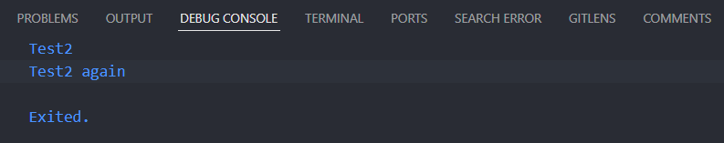

# Pertemuan 4: Pengantar Bahasa Pemrograman Dart - Bagian 3
|Nama|Muhammad Irfan Nur Hakim |
|----------------|--------------------------|
|Kelas          |TI-3F  |
|Absen          |`15`|
## Praktikum 1: Eksperimen Tipe Data List
---
### Langkah 1
```
void main(){
  var list = [1, 2, 3];
  assert(list.length == 3);
  assert(list[1] == 2);
  print(list.length);
  print(list[1]);

  list[1] = 1;
  assert(list[1] == 1);
  print(list[1]);
}
```
### Langkah 2
Silakan coba eksekusi (Run) kode pada langkah 1 tersebut. Apa yang terjadi? Jelaskan!

### Langkah 3
## Praktikum 2: Eksperimen Tipe Data Set
---
### Langkah 1
### Langkah 2
### Langkah 3
## Praktikum 3: Eksperimen Tipe Data Maps
---
### Langkah 1
### Langkah 2
### Langkah 3
## Praktikum 4: Eksperimen Tipe Data List
---
### Langkah 1
### Langkah 2
### Langkah 3
## Praktikum 5: Eksperimen Tipe Data Records
---
### Langkah 1
### Langkah 2
### Langkah 3
## Tugas Praktikum
---
### Soal 2
### Soal 3
### Soal 4
### Soal 5
### Soal 6
### Soal 7

