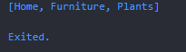
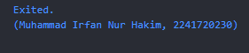

# Pertemuan 4: Pengantar Bahasa Pemrograman Dart - Bagian 3
|Nama|Muhammad Irfan Nur Hakim |
|----------------|--------------------------|
|Kelas          |TI-3F  |
|Absen          |`15`|
## Praktikum 1: Eksperimen Tipe Data List
---
### Langkah 1
```
void main(){
  var list = [1, 2, 3];
  assert(list.length == 3);
  assert(list[1] == 2);
  print(list.length);
  print(list[1]);

  list[1] = 1;
  assert(list[1] == 1);
  print(list[1]);
}
```
### Langkah 2
Silakan coba eksekusi (Run) kode pada langkah 1 tersebut. Apa yang terjadi? Jelaskan!
* Hasil Output:


> Kode program tersebut menunjukkan bagaimana sebuah list diakses, diperiksa, dan dimodifikasi. kode 'assert' itu digunakan sebagai alat untuk memvalidasi atau memeriksa apakah elemen tersebut benar atau tidak dan perubahan pada list diimplementasikan dengan mengakses elemen melalui indeks.

### Langkah 3
Ubah kode pada langkah 1 menjadi variabel final yang mempunyai index = 5 dengan default value = null. Isilah nama dan NIM Anda pada elemen index ke-1 dan ke-2. 
```
void main(){
  final List<String?> list = List.filled(5, null);

  list[1] = 'Muhammad Irfan Nur Hakim';  
  list[2] = '2241720230';  
  assert(list.length == 3);
  assert(list[1] == 2);
  print(list.length);
  print(list[1]);

  list[1] = '1';
  assert(list[1] == 1);
  print(list[1]);
}
```
* Hasil Output:


## Praktikum 2: Eksperimen Tipe Data Set
---
### Langkah 1
```
void main(){
  var halogens = {'fluorine', 'chlorine', 'bromine', 'iodine', 'astatine'};
  print(halogens);
}
```
### Langkah 2
Silakan coba eksekusi (Run) kode pada langkah 1 tersebut. Apa yang terjadi? Jelaskan! Lalu perbaiki jika terjadi error.
> Kode program tersebut akan menghasilkan isi dari variable halogens yaitu  'fluorine', 'chlorine', 'bromine', 'iodine', 'astatine'.
* Hasil Output:


### Langkah 3
Tambahkan kode program:
```
void main(){
  var halogens = {'fluorine', 'chlorine', 'bromine', 'iodine', 'astatine'};
  print(halogens);

  var names1 = <String>{};
  Set<String> names2 = {}; // This works, too.
  var names3 = {}; // Creates a map, not a set.

  print(names1);
  print(names2);
  print(names3);
}
```

* Hasil Output:


> Kode program tersebut hanya menampilkan kurung kurawal kosong karena variabel names1, names2, dan names3 masih kosong dan tidak ada isinya.

* Dengan menambahkan elemen Nama dan NIM pada kedua variabel Set yaitu `.add()` dan `.addAll()`

```
void main(){
  var names1 = <String>{};
  Set<String> names2 = {}; // This works, too.
  var names3 = {}; // Creates a map, not a set.

   // menambahkan ke names1 menggunakan .add()
  names1.add('Muhammad Irfan Nur Hakim');
  names1.add('2241720230');

  // menambahkan ke names2 menggunakan .addAll()
  names2.addAll(['Muhammad Irfan Nur Hakim', '2241720230']);  


  print(names1);
  print(names2);
  print(names3);
}
```
* Hasil Output:


> Jadi pada kode program tersebut fungsi add() menambahkan satu elemen ke dalam list, sementara addAll() menambahkan semua elemen dari list yang disediakan (atau yang dapat diubah) ke dalam list.
## Praktikum 3: Eksperimen Tipe Data Maps
---
### Langkah 1
```
void main(){
  var gifts = {
    // Key:    Value
    'first': 'partridge',
    'second': 'turtledoves',
    'fifth': 1
  };

  var nobleGases = {
    2: 'helium',
    10: 'neon',
    18: 2,
  };

  print(gifts);
  print(nobleGases);
}
```
### Langkah 2
* Hasil Output:


> **Penjelasan**: Pada kode program tersebut terdapat variable gifts dengan key string: 'first', 'second', dan 'fifth'. Tipe data tiap value nya berbeda yaitu berupa string dan integer. Sedangkan pada variable nobleGases terdapat 3 pasangan key dan value dengan tipe data string dan integer. Lalu mencetak isi maps gifts dan nobleGases ke console.

### Langkah 3
```
void main(){
  var gifts = {
    // Key:    Value
    'first': 'partridge',
    'second': 'turtledoves',
    'fifth': 1
  };

  var nobleGases = {
    2: 'helium',
    10: 'neon',
    18: 2,
  };

  var mhs1 = Map<String, String>();
  gifts['first'] = 'partridge';
  gifts['second'] = 'turtledoves';
  gifts['fifth'] = 'golden rings';

  var mhs2 = Map<int, String>();
  nobleGases[2] = 'helium';
  nobleGases[10] = 'neon';
  nobleGases[18] = 'argon';

  print(gifts);
  print(nobleGases);
}
```
* Hasil Output:


* Penjelasan: 
  >mhs1 dan mhs2 adalah maps kosong, diinisialisasi dengan tipe yang spesifik: mhs1 adalah maps dengan kunci string dan nilai string. Sedangkan mhs2 adalah maps dengan kunci integer dan nilai string.
  >* Untuk variable gifts, penambahan kode tersebut memperbarui nilai yang terkait dengan kunci 'fifth' dari 1 menjadi 'golden rings'.
  >* Untuk variable nobleGases, penambahan kode tersebut memperbarui nilai yang terkait dengan kunci 18 dari 2 menjadi 'argon'.

* Menambahkan elemen nama dan NIM Anda pada tiap variabel di atas (gifts, nobleGases, mhs1, dan mhs2).

```
void main() {
  var gifts = {
    // Key:    Value
    'first': 'partridge',
    'second': 'turtledoves',
    'fifth': 1
  };

  var nobleGases = {
    2: 'helium',
    10: 'neon',
    18: 2,
  };

  var mhs1 = Map<String, String>();
  mhs1['Nama'] = 'Muhammad Irfan Nur Hakim';
  mhs1['NIM'] = '2241720230';

  gifts['first'] = 'partridge';
  gifts['second'] = 'turtledoves';
  gifts['fifth'] = 'golden rings';

  var mhs2 = Map<int, String>();
  mhs2[1] = 'Muhammad Irfan Nur Hakim';
  mhs2[2] = '2241720230';

  nobleGases[2] = 'helium';
  nobleGases[10] = 'neon';
  nobleGases[18] = 'argon';

  print(mhs1);
  print(mhs2);
}
```

* Hasil Output:


## Praktikum 4: Eksperimen Tipe Data List
---
### Langkah 1
```
void main(){
  var list = [1, 2, 3];
  var list2 = [0, ...list];
  print(list);
  print(list2);
  print(list2.length);
}
```
### Langkah 2
* Hasil Output:


> Kode program tersebut terdapat `var list = [1, 2, 3];` yang berfungsi membuat daftar baru list yang berisi tiga elemen: 1, 2, dan 3.
Lalu var `list2 = [0, ...list];` untuk membuat daftar baru list2 dengan menggunakan spread/penyebaran operator (...) untuk memasukkan semua elemen dari list ke dalam daftar baru, dimulai dengan elemen 0. Ini sama dengan dengan [0, 1, 2, 3]. Program kemudian mencetak isi dari list, list2, dan panjang dari list2, yang berjumlah 4 elemen.

### Langkah 3
```
void main(){
  var list = [1, 2, 3];
  var list2 = [0, ...list];
  print(list);
  print(list2);
  print(list2.length);

  var list1 = [1, 2, null];
  print(list1);
  var list3 = [0, ...?list1];
  print(list3.length);
}
```

* Hasil Output:


> Kode tersebut menunjukkan bagaimana menggunakan spread operator (...) untuk menggabungkan list yang ada dan membuat list baru. list pada list1 berisi elemen null, tetapi spread operator masih dapat digunakan untuk menggabungkan elemen-elemen tersebut ke dalam list baru yaitu list3.

* Menambahkan variabel list berisi NIM menggunakan Spread Operators. 
```
void main() {
  var list = [1, 2, 3];
  var list2 = [0, ...list];
  print(list);
  print(list2);
  print(list2.length);

  var list1 = [1, 2, null];
  print(list1);
  var list3 = [0, ...list1];
  print(list3.length);

  var nim = [2241720230];
  var list4 = [0, ...list, ...nim];
  print(list4);
  print(list4.length);
}
```
* Hasil Output:


### Langkah 4
* Menambahkan kode program berikut, lalu coba eksekusi (Run) kode.
```
var nav = ['Home', 'Furniture', 'Plants', if (promoActive) 'Outlet'];
print(nav);
```

> Program tersebur error karena tidak ada deklarasi variabel promoActive. Sehingga harus deklarasi kan dengan tipe data boolean, seperti berikut:

* Jika promoActive = true, maka elemen 'Outlet' akan di cetak
```
  var promoActive = true;
  var nav = ['Home', 'Furniture', 'Plants', if (promoActive) 'Outlet'];
  print(nav);
```

* Jika promoActive = false, maka elemen 'Outlet' tidak akan di cetak
```
  var promoActive = false;
  var nav = ['Home', 'Furniture', 'Plants', if (promoActive) 'Outlet'];
  print(nav);
```


### Langkah 5
* Menambahkan kode program berikut, lalu coba eksekusi (Run) kode
```
  var nav2 = ['Home', 'Furniture', 'Plants', if (login case 'Manager') 'Inventory'];
  print(nav2);
```

> Program tersebur error karena tidak ada deklarasi variabel login. Sehingga harus di deklarasi kan valuenya dengan case 'Manager', maka elemen 'Inventory' akan di print, seperti berikut:
* Jika login = 'Manager', maka elemen 'Inventory' akan di cetak
```
  var login = 'Manager';
  // var login = 'User';
  var nav2 = ['Home', 'Furniture', 'Plants', if (login case 'Manager') 'Inventory'];
  print(nav2);
```

* Tetapi jika login != 'Manager', maka elemen 'Inventory' tidak akan di cetak
```
  var login = 'User';
  var nav2 = ['Home', 'Furniture', 'Plants', if (login case 'Manager') 'Inventory'];
  print(nav2);
```


### Langkah 6
* Menambahkan kode program berikut, lalu coba eksekusi (Run) kode
```
  var listOfInts = [1, 2, 3];
  var listOfStrings = ['#0', for (var i in listOfInts) '#$i'];
  assert(listOfStrings[1] == '#1');
  print(listOfStrings);
```
* Hasil Output:


> **Penjelasan**: Kode program tersebut terdapat 3 baris data yaitu pertama `var listOfInts = [1, 2, 3];` yang berfungsi menginisialisasinya dengan list tiga bilangan bulat: 1, 2, dan 3. Lalu `var listOfStrings = ['#0', for (var i in listOfInts) '#$i'];` untuk menginisialisasinya dengan daftar string baru dengan menggunakan loop koleksi for. Kemudian `assert(listOfStrings[1] == '#1');` itu untuk memeriksa apakah elemen kedua dari listOfStrings (pada indeks 1) sama dengan '#1'. Jika asersi gagal, program akan melempar AssertionError.
## Praktikum 5: Eksperimen Tipe Data Records
---
### Langkah 1
```
var record = ('first', a: 2, b: true, 'last');
print(record);
```
### Langkah 2


> Kode program tersebut terdapat variable record yang dideklarasikan dan diinisialisasi dengan nilai elemen yaitu string 'first', nilai named parameter a sama dengan nilai 2, nilai named parameter b sama dengan nilai true, dan string 'last'. Dart kemudian akan menginterpretasikan bagian pertama ('first') sebagai kunci dengan nilai null, dan bagian terakhir ('last') juga sebagai kunci dengan nilai null. Sehingga hasilnya seperti pada gambar output diatas.

### Langkah 3
```
void main(){
  var record = ('first', a: 2, b: true, 'last');
  print(record);
  
  var intRecord = (1, 2);
  var swapped = tukar(intRecord);
  print(swapped);
}

(int, int) tukar((int, int) record) {
  var (a, b) = record;
  return (b, a);
}
```
* Hasil Output:


> Kode fungsi `(int, int) tukar((int, int) record)` menunjukkan bahwa fungsi mengambil sebuah tuple dua integer sebagai input dan mengembalikan sebuah tuple dua integer. Baris `var (a, b) = record;` mengurai tuple input record menjadi dua variabel a dan b. Baris `return (b, a);` mengembalikan sebuah tuple baru dengan elemen-elemen yang telah ditukar.

### Langkah 4
```
// Record type annotation in a variable declaration:
(String, int) mahasiswa;
print(mahasiswa);
```
> Hasilnya akan error karena variable mahasiswa bernilai null, jadi harus di inisialisasi seperti berikut:

```
  (String, int) mahasiswa = ('Muhammad Irfan Nur Hakim', 2241720230);
  print(mahasiswa);
```

* Hasil Output:



### Langkah 5
```
  var mahasiswa2 = ('first', a: 2, b: true, 'last');

  print(mahasiswa2.$1); // Prints 'first'
  print(mahasiswa2.a); // Prints 2
  print(mahasiswa2.b); // Prints true
  print(mahasiswa2.$2); // Prints 'last'
```
* Hasil Output:


> Kode program akan mencetak isi dari record mahasiswa2 dengan cara mengakses nilai dari indexnya dan cara named parameternya. Seperti contohnya $1 itu berarti mengakses data pada index 1. Namun data yang memiliki named parameter tidak akan dianggapa sebagai index, maka akan dilewati dan bisa diakses dengan memanggil named parameternya. 


## Tugas Praktikum
---
### Soal 2
Jelaskan yang dimaksud Functions dalam bahasa Dart!
> Functions di Dart yaitu blok kode yang dapat digunakan kembali untuk melakukan tugas tertentu.

Ciri-ciri function yaitu
* Memiliki nama, parameter (opsional), body fungsi, dan nilai return (opsional).
* Bisa bersifat void (tidak mengembalikan nilai) atau mengembalikan nilai dari tipe tertentu.

Contoh penggunaan function di Dart adalah:

```
int add(int a, int b) {
  return a + b;
}

void main() {
  print(add(3, 4)); // Output: 7
}
```
### Soal 3
Jelaskan jenis-jenis parameter di Functions beserta contoh sintaksnya!
1. **Positional Parameters (Required Parameters)**: 
 Parameter yang wajib diisi saat function dipanggil. Urutan parameter sangat penting, dan setiap parameter harus diberikan nilai saat pemanggilan function. 
 Contoh:
    ```
    void printInfo(String name, int age) {
      print('Nama: $name, Umur: $age');
    }

    void main() {
      printInfo('Irfan', 20); // Output: Nama: Irfan, Umur: 20
    }
    ```
2. **Optional Positional Parameters**: 
 Optional positional parameters menggunakan tanda [] di sekitar parameter untuk menandakan bahwa mereka opsional. Jika parameter tidak diberikan, nilainya akan menjadi null atau sesuai default jika ditentukan.
 Contoh:
    ```
    void printInfo(String name, [int? age]) {
      print('Nama: $name, Umur: ${age ?? 'tidak diketahui'}');
    }

    void main() {
      printInfo('Irfan'); // Output: Nama: Irfan, Umur: tidak diketahui
      printInfo('Irfan', 20); // Output: Nama: Irfan, Umur: 20
    }
    ```
3. **Named Parameters**: 
 Named parameters menggunakan tanda kurung kurawal {} di sekitar parameter dan dipanggil dengan menyebutkan namanya. Mereka opsional secara default kecuali ditentukan sebagai required menggunakan anotasi @required atau kata kunci required. Contoh:
    ```
    void printInfo({required String name, int age = 18}) {
      print('Nama: $name, Umur: $age');
    }

    void main() {
      printInfo(name: 'Irfan'); // Output: Nama: Irfan, Umur: 18
      printInfo(name: 'Irfan', age: 20); // Output: Nama: Irfan, Umur: 20
    }
    ```
4. **Default Parameters**: 
Parameter dengan nilai default digunakan untuk memberikan nilai standar ketika parameter tersebut tidak diberikan saat pemanggilan function. Ini biasanya digunakan bersama named parameters. Contoh:
    ```
    void greet(String name, {String greeting = 'Hello'}) {
      print('$greeting, $name!');
    }

    void main() {
      greet('Irfan'); // Output: Hello, Irfan!
      greet('Irfan', greeting: 'Selamat Pagi'); // Output: Selamat Pagi, Irfan!
    }
    ```
5. **Optional Named Parameters**: 
 Optional named parameters bersifat opsional, artinya function bisa dipanggil tanpa menyertakan parameter ini. Jika parameter ini tidak diberikan, maka nilainya akan menjadi null kecuali ada nilai default yang disediakan.Contoh:
    ```
    void printUserInfo({String? name, int? age}) {
      print('Nama: ${name ?? 'tidak diketahui'}, Umur: ${age ?? 'tidak diketahui'}');
    }

    void main() {
      printUserInfo(); // Output: Nama: tidak diketahui, Umur: tidak diketahui
      printUserInfo(name: 'Irfan'); // Output: Nama: Irfan, Umur: tidak diketahui
    }
    ```


### Soal 4
Jelaskan maksud Functions sebagai first-class objects beserta contoh sintaknya!
* Ini berarti bahwa fungsi-fungsi di Dart dapat diperlakukan seperti objek lain. Sebagai objek first-class, fungsi memiliki kemampuan berikut:

  > Fungsi bisa disimpan ke dalam variabel, seperti nilai data lainnya (misalnya int, String).
  ```
  void sayHello() {
    print('Hello!');
  }

  void main() {
    var greet = sayHello; // Menyimpan fungsi dalam variabel
    greet(); // Memanggil fungsi melalui variabel
  }
  ```
  > Fungsi bisa digunakan sebagai argumen dalam pemanggilan fungsi lainnya.
  ```
  void sayHello() {
    print('Hello!');
  }

  void executeFunction(Function func) {
    func(); // Memanggil fungsi yang dilewatkan
  }

  void main() {
    executeFunction(sayHello); // Mengirim fungsi sebagai argumen
  }
  ```
  > Fungsi bisa dikembalikan sebagai hasil dari fungsi lainnya.
  ```
  Function getGreetingFunction() {
    return () => print('Hello from returned function!');
  }

  void main() {
    var greetingFunction = getGreetingFunction(); // Mendapatkan fungsi dari return
    greetingFunction(); // Memanggil fungsi yang dikembalikan
  }
  ```
  > Fungsi dapat disimpan dalam list, map, atau struktur data lainnya.
  ```
  void sayHello() {
    print('Hello!');
  }

  void sayGoodbye() {
    print('Goodbye!');
  }

  void main() {
    var functions = [sayHello, sayGoodbye]; // Menyimpan fungsi dalam list
    functions[0](); // Memanggil sayHello
    functions[1](); // Memanggil sayGoodbye
  }
  ```

### Soal 5
Apa itu Anonymous Functions? Jelaskan dan berikan contohnya!
> Anonymous functions (fungsi anonim) adalah fungsi yang tidak memiliki nama dan biasanya digunakan untuk tugas-tugas sederhana yang bersifat sementara, seperti callback atau operasi sekali pakai.
* Contoh Anonymous Function:
```
void main() {
  var numbers = [1, 2, 3];
  numbers.forEach((num) {
    print(num * 2); // Menggunakan anonymous function
  });
}
```
> Pada tersebut, (num) { print(num * 2); } adalah anonymous function yang digunakan sebagai argumen dalam metode forEach. 
### Soal 6
Jelaskan perbedaan Lexical scope dan Lexical closures! Berikan contohnya!
> * Lexical Scope itu fokus pada bagaimana variabel diakses dalam blok kode berdasarkan tempat deklarasinya.
```
void main() {
  String name = 'Irfan'; // Variabel dalam lingkup 'main'

  void printName() {
    print(name); // Bisa akses variabel 'name' karena ada dalam scope luar
  }

  printName(); // Output: Irfan
}
```
> * Lexical Closure itu fungsi dapat mengingat dan mengakses variabel dari scope luar meskipun scope itu telah selesai dieksekusi.
```
Function makeCounter() {
  int count = 0; // Variabel dalam lingkup makeCounter
  return () {
    count++; // Menggunakan variabel 'count' dari scope luar
    return count;
  };
}

void main() {
  var counter = makeCounter(); // Membuat closure
  print(counter()); // Output: 1
  print(counter()); // Output: 2
}
```

### Soal 7
Jelaskan dengan contoh cara membuat return multiple value di Functions!
> Functions pada dart secara default hanya bisa mengembalikan satu nilai. Namun, jika kita ingin mengembalikan lebih dari satu nilai dari sebuah fungsi, kita bisa menggunakan, seperti:
> * `List` yang cocok untuk beberapa nilai dengan tipe yang sama.
> * `Map` yang cocok untuk beberapa nilai dengan tipe yang berbeda dan membutuhkan label deskriptif.
> * `Class` yang cocok untuk struktur data yang lebih kompleks dan terorganisir.


* Contoh Return Multiple Values menggunakan List
```
List<String> getFullName() {
  String firstName = 'Muhammad';
  String lastName = 'Irfan';
  return [firstName, lastName]; // Mengembalikan list
}

void main() {
  var fullName = getFullName();
  print('First Name: ${fullName[0]}, Last Name: ${fullName[1]}');
  // Output: First Name: Muhammad, Last Name: Irfan
}

```

