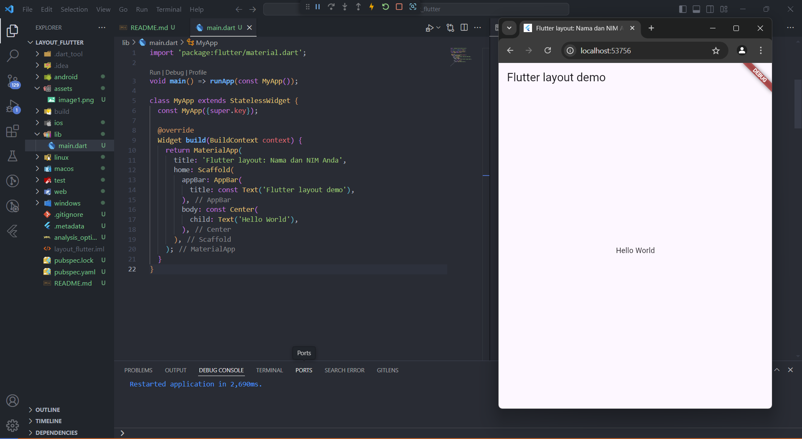

# Laporan Pertemuan 6: Layout dan Navigasi Flutter

|||
|-|-|
|Nama|Muhammad Irfan Nur Hakim|
|Kelas|TI-3F|
|Absen|15|
|||

## Praktikum 1: Membuat Project Flutter Baru
### Langkah 1: Buat Project Baru
Buatlah sebuah project flutter baru dengan nama layout_flutter. Atau sesuaikan style laporan praktikum yang Anda buat.
### Langkah 2: Buka file lib/main.dart
Buka file main.dart lalu ganti dengan kode berikut. Isi nama dan NIM Anda di text title.
```
import 'package:flutter/material.dart';

void main() => runApp(const MyApp());

class MyApp extends StatelessWidget {
  const MyApp({super.key});

  @override
  Widget build(BuildContext context) {
    return MaterialApp(
      title: 'Flutter layout: Nama dan NIM Anda',
      home: Scaffold(
        appBar: AppBar(
          title: const Text('Flutter layout demo'),
        ),
        body: const Center(
          child: Text('Hello World'),
        ),
      ),
    );
  }
}
```
Hasil nya adalah sebagai berikut:


### Langkah 3: Identifikasi layout diagram
Buat nama project flutter hello_world seperti berikut, lalu tekan Enter. Tunggu hingga proses pembuatan project baru selesai.
### Langkah 4: Implementasi title row
Pertama, Anda akan membuat kolom bagian kiri pada judul. Tambahkan kode berikut di bagian atas metode build() di dalam kelas MyApp:

* /* soal 1 */ Letakkan widget Column di dalam widget Expanded agar menyesuaikan ruang yang tersisa di dalam widget Row. Tambahkan properti crossAxisAlignment ke CrossAxisAlignment.start sehingga posisi kolom berada di awal baris.

* /* soal 2 */ Letakkan baris pertama teks di dalam Container sehingga memungkinkan Anda untuk menambahkan padding = 8. Teks ‘Batu, Malang, Indonesia' di dalam Column, set warna menjadi abu-abu.

* /* soal 3 */ Dua item terakhir di baris judul adalah ikon bintang, set dengan warna merah, dan teks "41". Seluruh baris ada di dalam Container dan beri padding di sepanjang setiap tepinya sebesar 32 piksel. Kemudian ganti isi body text ‘Hello World' dengan variabel titleSection seperti berikut:

Jawaban kode program:
```
import 'package:flutter/material.dart';

void main() => runApp(const MyApp());

class MyApp extends StatelessWidget {
  const MyApp({super.key});

  @override
  Widget build(BuildContext context) {
    Widget titleSection = Container(
      padding: const EdgeInsets.all(32), // Padding for the entire row
      child: Row(
        children: [
          Expanded(
            /* soal 1 */
            child: Column(
              crossAxisAlignment: CrossAxisAlignment.start,
              children: [
                /* soal 2 */
                Container(
                  padding: const EdgeInsets.only(bottom: 8), 
                  child: const Text(
                    'Wisata Gunung di Batu',
                    style: TextStyle(
                      fontWeight: FontWeight.bold,
                    ),
                  ),
                ),
                const Text(
                  'Batu, Malang, Indonesia',
                  style: TextStyle(
                    color: Colors.grey, 
                  ),
                ),
              ],
            ),
          ),
          /* soal 3 */
          const Icon(
            Icons.star,
            color: Colors.red, 
          ),
          const Text('41'), 
        ],
      ),
    );

    return MaterialApp(
      title: 'Flutter layout: Muhammad Irfan Nur Hakim | 2241720230',
      home: Scaffold(
        appBar: AppBar(
          title: const Text('Flutter layout demo'),
        ),
        body: Column(
          children: [
            titleSection, // Replace 'Hello World' with titleSection
            // Add other sections here if needed
          ],
        ),
      ),
    );
  }
}
```
Hasil praktikum 1 adalah sebagai berikut:


## Praktikum 2: Implementasi button row
### Langkah 1: Buat method Column _buildButtonColumn
Bagian tombol berisi 3 kolom yang menggunakan tata letak yang sama—sebuah ikon di atas baris teks. Kolom pada baris ini diberi jarak yang sama, dan teks serta ikon diberi warna primer.

Karena kode untuk membangun setiap kolom hampir sama, buatlah metode pembantu pribadi bernama buildButtonColumn(), yang mempunyai parameter warna, Icon dan Text, sehingga dapat mengembalikan kolom dengan widgetnya sesuai dengan warna tertentu.

lib/main.dart (_buildButtonColumn)
```
class MyApp extends StatelessWidget {
  const MyApp({super.key});

  @override
  Widget build(BuildContext context) {
    // ···
  }

  Column _buildButtonColumn(Color color, IconData icon, String label) {
    return Column(
      mainAxisSize: MainAxisSize.min,
      mainAxisAlignment: MainAxisAlignment.center,
      children: [
        Icon(icon, color: color),
        Container(
          margin: const EdgeInsets.only(top: 8),
          child: Text(
            label,
            style: TextStyle(
              fontSize: 12,
              fontWeight: FontWeight.w400,
              color: color,
            ),
          ),
        ),
      ],
    );
  }
}
```
Hasil praktikum 2 adalah sebagai berikut:


## Praktikum 3: Implementasi text section
### Langkah 1: Buat widget textSection
Tentukan bagian teks sebagai variabel. Masukkan teks ke dalam Container dan tambahkan padding di sepanjang setiap tepinya. Tambahkan kode berikut tepat di bawah deklarasi buttonSection:
```
    Widget textSection = Container(
      padding: const EdgeInsets.all(32),
      child: const Text(
        'Dino Park Jatim Park 3 cocok untuk segala usia, terutama anak-anak sekolah. Tempat ini ideal sebagai wisata edukasi untuk mengenal hewan purba, di mana pengunjung bisa mempelajari ukuran, kebiasaan, dan habitat dinosaurus serta makhluk purba lainnya yang telah punah. '
        ' Muhammad Irfan Nur Hakim | 2241720230 🙂.',
        softWrap: true,
      ),
    );
```
### Langkah 2: Tambahkan variabel text section ke body
Tambahkan widget variabel textSection ke dalam body seperti berikut:
```
return MaterialApp(
      title: 'Flutter layout: Muhammad Irfan Nur Hakim | 2241720230',
      home: Scaffold(
        appBar: AppBar(
          title: const Text('Flutter layout demo'),
        ),
        body: Column(
          children: [
            titleSection,
            buttonSection, 
            textSection
          ],
        ),
      ),
    );
```
Hasil praktikum 3 adalah sebagai berikut:


## Praktikum 4: Implementasi image section
### Langkah 1: Siapkan aset gambar
Anda dapat mencari gambar di internet yang ingin ditampilkan. Buatlah folder images di root project layout_flutter. Masukkan file gambar tersebut ke folder images, lalu set nama file tersebut ke file pubspec.yaml seperti berikut:
```
flutter:
  uses-material-design: true

  # To add assets to your application, add an assets section, like this:
  assets:
  - assets/
```

### Langkah 2: Tambahkan gambar ke body
Tambahkan aset gambar ke dalam body seperti berikut:
```
        body: Column(
          children: [
            Image.asset(
              'assets/jtp3.jpg',
              width: 600,
              height: 240,
              fit: BoxFit.cover,
            ),
            titleSection,
            buttonSection, 
            textSection// Replace 'Hello World' with titleSection
            // Add other sections here if needed
          ],
        ),
```

### Langkah 3: Terakhir, ubah menjadi ListView
Pada langkah terakhir ini, atur semua elemen dalam ListView, bukan Column, karena ListView mendukung scroll yang dinamis saat aplikasi dijalankan pada perangkat yang resolusinya lebih kecil.
```
        body: ListView(
          children: [
            Image.asset(
              'assets/jtp3.jpg',
              width: 600,
              height: 240,
              fit: BoxFit.cover,
            ),
            titleSection,
            buttonSection, 
            textSection// Replace 'Hello World' with titleSection
            // Add other sections here if needed
          ],
        ),
```

Hasil praktikum 4 adalah sebagai berikut:


## Tugas Praktikum 1: Implementasi di project baru "basic_layout_flutter" 
Silakan implementasikan di project baru "basic_layout_flutter" dengan mengakses sumber ini: https://docs.flutter.dev/codelabs/layout-basics
Kode program:
```
import 'package:flutter/material.dart';

void main() {
  runApp(MaterialApp(
    home: StrawberryPavlovaScreen(),
  ));
}

class StrawberryPavlovaScreen extends StatelessWidget {
  @override
  Widget build(BuildContext context) {
    return Scaffold(
      appBar: AppBar(
        title: Text(
          'Strawberry Pavlova - M. Irfan Nur Hakim',
          style: TextStyle(color: Colors.white), 
        ),
        backgroundColor: Colors.red,
      ),
      body: SingleChildScrollView(
        child: Padding(
          padding: const EdgeInsets.all(16.0),
          child: Row(
            mainAxisAlignment: MainAxisAlignment.spaceEvenly,
            children: [
              // Left Column with text
              Expanded(
                flex: 1, // Set flex to 1 to make it 50%
                child: Column(
                  crossAxisAlignment: CrossAxisAlignment.start,
                  children: [
                    // Title Section
                    Text(
                      'Strawberry Pavlova',
                      style: TextStyle(
                        fontSize: 24.0,
                        fontWeight: FontWeight.bold,
                      ),
                    ),
                    SizedBox(height: 8.0),

                    // Description Section
                    Text(
                      'Pavlova is a meringue-based dessert named after the Russian ballerina Anna Pavlova. '
                      'Pavlova features a crisp crust and soft, light inside, topped with fruit and whipped cream.',
                      style: TextStyle(fontSize: 16.0), 
                    ),
                    SizedBox(height: 16.0),

                    // Ratings Section
                    Row(
                      children: [
                        Icon(Icons.star, color: Colors.red),
                        Icon(Icons.star, color: Colors.red),
                        Icon(Icons.star, color: Colors.red),
                        Icon(Icons.star, color: Colors.red),
                        Icon(Icons.star_half, color: Colors.red),
                        SizedBox(width: 8.0),
                        Text('170 Reviews', style: TextStyle(fontSize: 16.0)),
                      ],
                    ),
                    SizedBox(height: 16.0),

                    // Info Section (Prep Time, Cook Time, Feeds)
                    Row(
                      mainAxisAlignment: MainAxisAlignment.spaceBetween,
                      children: [
                        InfoTile(
                          icon: Icons.timer,
                          label: 'PREP:',
                          value: '25 min',
                        ),
                        InfoTile(
                          icon: Icons.cookie,
                          label: 'COOK:',
                          value: '1 hr',
                        ),
                        InfoTile(
                          icon: Icons.restaurant,
                          label: 'FEEDS:',
                          value: '4-6',
                        ),
                      ],
                    ),
                  ],
                ),
              ),

              SizedBox(width: 16.0), // Add spacing between text and image

              // Right Column with Image
              Expanded(
                flex: 1, // Set flex to 1 to make it 50%
                child: Image.asset(
                  'images/strawberry_pavlova.jpg',
                  height: 300,
                  width: double.infinity,
                  fit: BoxFit.cover,
                ),
              ),
            ],
          ),
        ),
      ),
    );
  }
}

// InfoTile Widget to display each info section (Prep, Cook, Feeds)
class InfoTile extends StatelessWidget {
  final IconData icon;
  final String label;
  final String value;

  InfoTile({required this.icon, required this.label, required this.value});

  @override
  Widget build(BuildContext context) {
    return Column(
      children: [
        Icon(icon, color: Colors.green),
        SizedBox(height: 4.0),
        Text(
          label,
          style: TextStyle(fontWeight: FontWeight.bold),
        ),
        Text(value),
      ],
    );
  }
}
```

Hasil Kode Program:


## Praktikum 5: Membangun Navigasi di Flutter
### Langkah 1: Siapkan project baru
Sebelum melanjutkan praktikum, buatlah sebuah project baru Flutter dengan nama belanja dan susunan folder seperti pada gambar berikut. Penyusunan ini dimaksudkan untuk mengorganisasi kode dan widget yang lebih mudah.


### Langkah 2: Mendefinisikan Route
```
import 'package:flutter/material.dart';

class HomePage extends StatelessWidget {
  const HomePage({super.key});

  @override
  Widget build(BuildContext context) {
    return const Placeholder();
  }
}
```

### Langkah 3: Lengkapi Kode di main.dart
```
void main() {
  runApp(MaterialApp(
    initialRoute: '/',
    routes: {
      '/': (context) => const HomePage(),
      '/item': (context) => const ItemPage(),
    },
  ));
}
```

### Langkah 4: Membuat data model
```
class Item {
  String name;
  int price;

  Item({required this.name, required this.price});
}
```

### Langkah 5: Lengkapi kode di class HomePage 
```
import 'package:belanja/models/item.dart';
import 'package:flutter/material.dart';

class HomePage extends StatelessWidget {
  final List<Item> items = [
    Item(name: 'Item 1', price: 100),
    Item(name: 'Item 1', price: 100),
  ];
  
  @override
  Widget build(BuildContext context) {
    throw UnimplementedError();
  }
}

```

### Langkah 6: Membuat ListView dan itemBuilder
Jalankan aplikasi pada emulator atau pada device anda.


### Langkah 7: Menambahkan aksi pada ListView
```
import 'package:flutter/material.dart';
import 'package:belanja/models/item.dart';
import 'package:belanja/pages/item_page.dart'; // Pastikan untuk mengimpor ItemPage

class HomePage extends StatelessWidget {
  final List<Item> items = [
    Item(name: 'Sugar', price: 5000),
    Item(name: 'Salt', price: 2000),
  ];

  @override
  Widget build(BuildContext context) {
    return Scaffold(
      appBar: AppBar(
        title: const Text(
          'Shopping List - Muhammad Irfan N.H.',
          style: TextStyle(
            color: Colors.white, // Set the text color to white
          ),
        ),
        backgroundColor: Colors.blue,
      ),
      body: Container(
        margin: const EdgeInsets.all(8),
        child: ListView.builder(
          padding: const EdgeInsets.all(8),
          itemCount: items.length,
          itemBuilder: (context, index) {
            final item = items[index];
            return InkWell(
              onTap: () {
                // Navigasi ke ItemPage dan kirim item yang dipilih
                Navigator.push(
                  context,
                  MaterialPageRoute(
                    builder: (context) => ItemPage(item: item),
                  ),
                );
              },
              child: Card(
                elevation: 4,
                child: ListTile(
                  title: Text(item.name),
                  trailing: Text(item.price.toString()),
                ),
              ),
            );
          },
        ),
      ),
    );
  }
}
```
Hasil pada praktikum 5:


## Tugas Praktikum 2: 
Implementasi di project "belanja" dengan menambahkan atribut foto produk, stok, dan rating seperti di aplikasi marketplace pada umumnya. 


