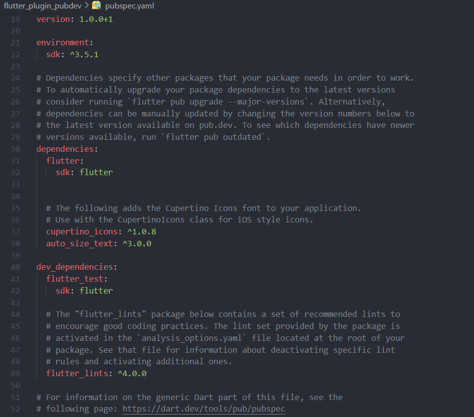
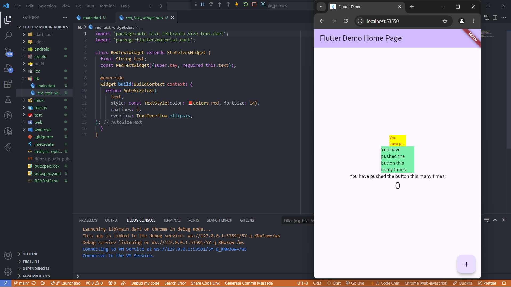

# Laporan Pertemuan 7: Manajemen Plugin

|||
|-|-|
|Nama|Muhammad Irfan Nur Hakim|
|Kelas|TI-3F|
|Absen|15|
|||

## Praktikum Menerapkan Plugin di Project Flutter
### Langkah 1: Buat Project Baru
Buatlah sebuah project flutter baru dengan nama flutter_plugin_pubdev. Lalu jadikan repository di GitHub Anda dengan nama flutter_plugin_pubdev.

### Langkah 2: Menambahkan Plugin
Tambahkan plugin auto_size_text menggunakan perintah berikut di terminal
```dart
flutter pub add auto_size_text
```
Jika berhasil, maka akan tampil nama plugin beserta versinya di file pubspec.yaml pada bagian dependencies.



### Langkah 3: Buat file red_text_widget.dart
Buat file baru bernama red_text_widget.dart di dalam folder lib lalu isi kode seperti berikut.
```dart
import 'package:flutter/material.dart';

class RedTextWidget extends StatelessWidget {
  const RedTextWidget({Key? key}) : super(key: key);

  @override
  Widget build(BuildContext context) {
    return Container();
  }
}
```

### Langkah 4: Tambah Widget AutoSizeText
Masih di file red_text_widget.dart, untuk menggunakan plugin auto_size_text, ubahlah kode return Container() menjadi seperti berikut.
```dart
return AutoSizeText(
      text,
      style: const TextStyle(color: Colors.red, fontSize: 14),
      maxLines: 2,
      overflow: TextOverflow.ellipsis,
);
```

### Langkah 5: Buat Variabel text dan parameter di constructor
Tambahkan variabel text dan parameter di constructor seperti berikut.
```dart
final String text;

const RedTextWidget({Key? key, required this.text}) : super(key: key);
```

### Langkah 6: Tambahkan widget di main.dart
Buka file main.dart lalu tambahkan di dalam children: pada class _MyHomePageState
```dart
Container(
   color: Colors.yellowAccent,
   width: 50,
   child: const RedTextWidget(
             text: 'You have pushed the button this many times:',
          ),
),
Container(
    color: Colors.greenAccent,
    width: 100,
    child: const Text(
           'You have pushed the button this many times:',
          ),
),
```


## Tugas Praktikum
1. Jelaskan maksud dari langkah 2 pada praktikum tersebut!
    > Pada percobaan langkah 2 tersebut tujuannya untuk menambahkan plugin yang disebut `auto_size_text` ke proyek Flutter. Plugin ini memungkinkan teks otomatis menyesuaikan ukurannya agar sesuai dengan ruang yang tersedia di dalam widget, tanpa harus mengatur ukuran teks secara manual.
2. Jelaskan maksud dari langkah 5 pada praktikum tersebut!
    > Pada percobaan langkah 5 tersebut tujuannya untuk memberikan parameter teks saat widget `RedTextWidget` dibuat, agar widget tersebut bisa menampilkan teks yang diberikan oleh pengguna.
3. Pada langkah 6 terdapat dua widget yang ditambahkan, jelaskan fungsi dan perbedaannya!
    > Pada langkah 6 terdapat 2 widget yaitu RedTextWidget yang menggunakan plugin AutoSizeText dan widget Text bawaan dari Flutter. Perbedaannya seperti berikut:
    > * AutoSizeText secara otomatis menyesuaikan ukuran teks agar muat di ruang terbatas, sedangkan Text tidak melakukan penyesuaian otomatis.
    > * AutoSizeText membatasi jumlah baris dan menggunakan elipsis (...) saat teks tidak muat, sementara Text memerlukan pengaturan manual untuk overflow.
    > * AutoSizeText ideal untuk ruang terbatas agar teks tetap tampil dengan rapi, sedangkan Text cocok untuk ruang yang cukup tanpa perlu perubahan ukuran teks.
    
4. Jelaskan maksud dari tiap parameter yang ada di dalam plugin auto_size_text berdasarkan tautan pada dokumentasi [auto_size_text](https://pub.dev/documentation/auto_size_text/latest/) !
    > * key: Mengontrol bagaimana suatu widget menggantikan widget lain di dalam pohon widget.
    > * textKey: Menentukan kunci (key) untuk widget Text yang dihasilkan.
    > * style: Menentukan gaya teks (jika tidak null).
    > * minFontSize: Mengatur ukuran teks minimum saat teks diubah secara otomatis. Diabaikan jika presetFontSizes telah diatur.
    > * maxFontSize: Mengatur ukuran teks maksimum saat diubah secara otomatis. Diabaikan jika presetFontSizes telah diatur.
    > * stepGranularity: Menentukan ukuran perubahan langkah untuk font saat menyesuaikan ukuran teks.
    > * presetFontSizes: Ukuran font yang telah ditentukan sebelumnya (harus diurutkan dari besar ke kecil).
    > * group: Menyinkronkan ukuran teks pada beberapa widget AutoSizeText.
    > * textAlign: Menentukan perataan teks secara horizontal.
    > * textDirection: Menentukan arah teks, yang mempengaruhi bagaimana TextAlign.start dan TextAlign.end diinterpretasikan.
    > * locale: Memilih font yang sesuai dengan lokal tertentu.
    > * softWrap: Menentukan apakah teks harus dipisahkan pada jeda baris lunak.
    > * wrapWords: Menentukan apakah kata-kata yang tidak muat di satu baris harus dipisahkan (default: true).
    > * overflow: Menentukan bagaimana menangani teks yang melebihi ruang visual yang disediakan.
    > * overflowReplacement: Widget pengganti yang akan ditampilkan jika teks melampaui batas.
    > * textScaleFactor: Mengatur rasio piksel font terhadap piksel logis, memengaruhi ukuran teks, minFontSize, maxFontSize, dan presetFontSizes.
    > * maxLines: Menentukan jumlah baris maksimum yang dapat ditempati teks.
    > * semanticsLabel: Label alternatif untuk teks dalam konteks aksesibilitas.
