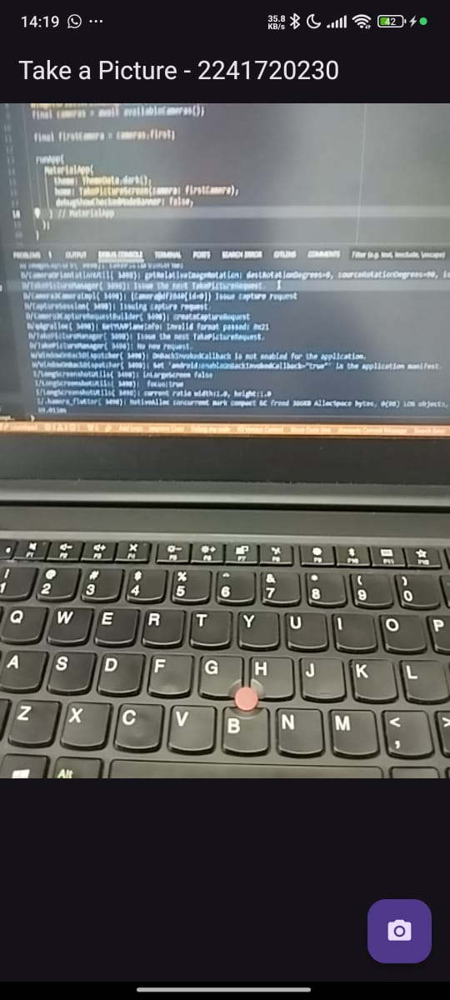
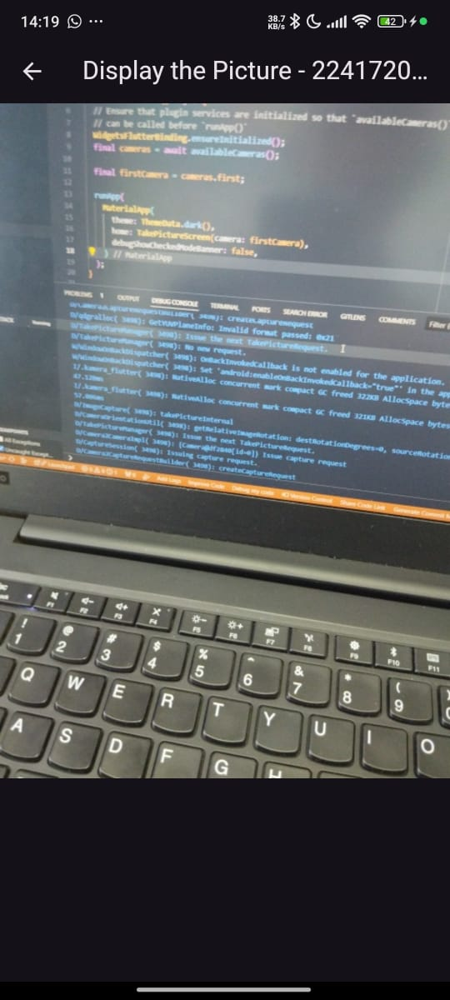
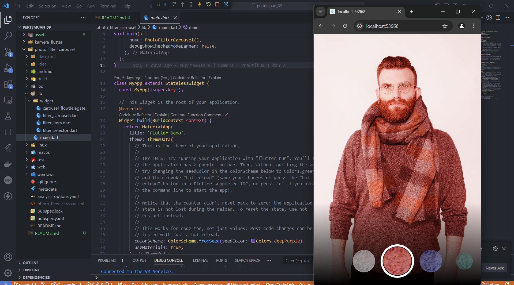
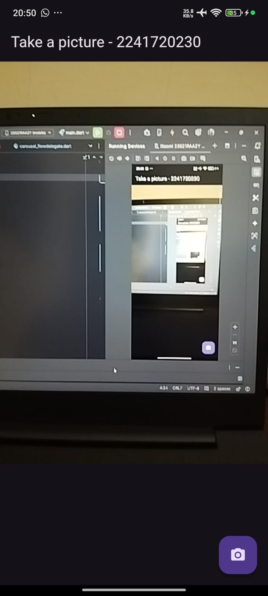
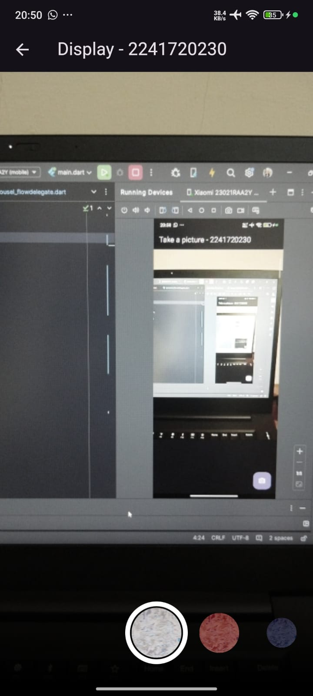
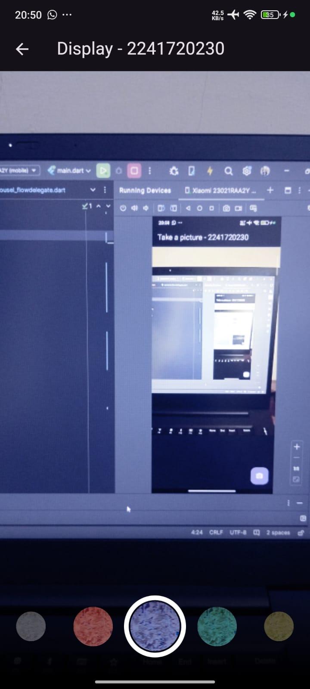

# Laporan Pertemuan 9: Camera

|||
|-|-|
|Nama|Muhammad Irfan Nur Hakim|
|Kelas|TI-3F|
|NIM|2241720230|
|Absen|15|
|||

## Praktikum 1: Mengambil Foto dengan Kamera di Flutter
---
### Langkah 1: Buat Project Baru
Buatlah sebuah project flutter baru dengan nama kamera_flutter, lalu sesuaikan style laporan praktikum yang Anda buat.

### Langkah 2: Tambah dependensi yang diperlukan
Anda memerlukan tiga dependensi pada project flutter untuk menyelesaikan praktikum ini.

* camera → menyediakan seperangkat alat untuk bekerja dengan kamera pada device.

* path_provider → menyediakan lokasi atau path untuk menyimpan hasil foto.

* path → membuat path untuk mendukung berbagai platform.

Untuk menambahkan dependensi plugin, jalankan perintah flutter pub add seperti berikut di terminal:
```
flutter pub add camera path_provider path
```

### Langkah 3: Ambil Sensor Kamera dari device
Selanjutnya, kita perlu mengecek jumlah kamera yang tersedia pada perangkat menggunakan plugin camera seperti pada kode berikut ini. Kode ini letakkan dalam void main().
```
Future<void> main() async {
    WidgetsFlutterBinding.ensureInitialized();
    final cameras = await availableCameras();
    final firstCamera = cameras.first;
    runApp()
}
```
### Langkah 4: Buat dan inisialisasi CameraController
```
import 'package:flutter/material.dart';
import 'package:camera/camera.dart';
import 'package:kamera_flutter/widget/displaypicture_screen.dart';

class TakePictureScreen extends StatefulWidget {
  const TakePictureScreen({super.key, required this.camera});

  final CameraDescription camera;

  @override
  TakePictureScreenState createState() => TakePictureScreenState();
}

class TakePictureScreenState extends State<TakePictureScreen> {
  late CameraController _controller;
  late Future<void> _initializeControllerFuture;

  @override
  void initState() {
    super.initState();
    _controller = CameraController(
      widget.camera,
      ResolutionPreset.medium,
    );
    _initializeControllerFuture = _controller.initialize();
  }

  @override
  void dispose() {
    _controller.dispose();
    super.dispose();
  }
}
```

### Langkah 5: Gunakan CameraPreview untuk menampilkan preview foto
```
  @override
  Widget build(BuildContext context) {
    return Scaffold(
      appBar: AppBar(title: const Text('Take a Picture - 2241720230')),
      body: FutureBuilder<void>(
        future: _initializeControllerFuture,
        builder: (context, snapshot) {
          if (snapshot.connectionState == ConnectionState.done) {
            return CameraPreview(_controller);
          } else {
            return const Center(child: CircularProgressIndicator());
          }
        },
      ),
    )
  }
```

### Langkah 6: Ambil foto dengan CameraController
```
FloatingActionButton(
  onPressed: () async {
    try {
      await _initializeControllerFuture;
      final image = await _controller.takePicture();
    } catch (e) {
      print(e);
    }
  },
  child: const Icon(Icons.camera_alt),
)
```
### Langkah 7: Buat widget baru DisplayPictureScreen
```
import 'dart:io';
import 'package:flutter/material.dart';

class DisplaypictureScreen extends StatelessWidget {
  const DisplaypictureScreen({super.key, required this.imagePath});
  
  final String imagePath;

  @override
  Widget build(BuildContext context) {
    return Scaffold(
      appBar: AppBar(title: const Text('Display the Picture - 2241720230')),
      body: Image.file(File(imagePath)),      
    );
  }
}
```

### Langkah 8: Edit main.dart
```
runApp(
    MaterialApp(
      theme: ThemeData.dark(),
      home: TakePictureScreen(
        // Pass the appropriate camera to the TakePictureScreen widget.
        camera: firstCamera,
      )
      debugShowCheckedModeBanner: false,
    ),
  );
```
### Langkah 9: Menampilkan hasil foto
```
floatingActionButton: FloatingActionButton(
        onPressed: () async {
          try {
            await _initializeControllerFuture;
            final image = await _controller.takePicture();

            if (!context.mounted) return;

            await Navigator.of(context).push(
              MaterialPageRoute(
                builder: (context) => DisplaypictureScreen(
                  imagePath: image.path
                ),
              ),
            );
            // ScaffoldMessenger.of(context).showSnackBar(
            //   SnackBar(content: Text('Picture saved to ${image.path}')),
            // );
          } catch (e) {
            print(e);
          }
        },
        child: const Icon(Icons.camera_alt),
      ),
```

### Hasil output kode program:






## Praktikum 2: Membuat photo filter carousel
---
### Langkah 1: Buat project baru
Buatlah project flutter baru di pertemuan 09 dengan nama photo_filter_carousel

### Langkah 2: Buat widget Selector ring dan dark gradient
lib/widget/filter_selector.dart
```
import 'package:flutter/material.dart';
import 'package:flutter/rendering.dart' show ViewportOffset;
import 'package:photo_filter_carousel/widget/carousel_flowdelegate.dart';
import 'package:photo_filter_carousel/widget/filter_item.dart';

@immutable
class FilterSelector extends StatefulWidget {
  const FilterSelector({
    super.key,
    required this.filters,
    required this.onFilterChanged,
    this.padding = const EdgeInsets.symmetric(vertical: 24),
  });

  final List<Color> filters;
  final void Function(Color selectedColor) onFilterChanged;
  final EdgeInsets padding;

  @override
  State<FilterSelector> createState() => _FilterSelectorState();
}

class _FilterSelectorState extends State<FilterSelector> {
  static const _filtersPerScreen = 5;
  static const _viewportFractionPerItem = 1.0 / _filtersPerScreen;

  late final PageController _controller;
  late int _page;

  int get filterCount => widget.filters.length;

  Color itemColor(int index) => widget.filters[index % filterCount];

  @override
  void initState() {
    super.initState();
    _page = 0;
    _controller = PageController(
      initialPage: _page,
      viewportFraction: _viewportFractionPerItem,
    );
    _controller.addListener(_onPageChanged);
  }

  void _onPageChanged() {
    final page = (_controller.page ?? 0).round();
    if (page != _page) {
      _page = page;
      widget.onFilterChanged(widget.filters[page]);
    }
  }

  void _onFilterTapped(int index) {
    _controller.animateToPage(
      index,
      duration: const Duration(milliseconds: 450),
      curve: Curves.ease,
    );
  }

  @override
  void dispose() {
    _controller.dispose();
    super.dispose();
  }

  @override
  Widget build(BuildContext context) {
    return Scrollable(
      controller: _controller,
      axisDirection: AxisDirection.right,
      physics: const PageScrollPhysics(),
      viewportBuilder: (context, viewportOffset) {
        return LayoutBuilder(
          builder: (context, constraints) {
            final itemSize = constraints.maxWidth * _viewportFractionPerItem;
            viewportOffset
              ..applyViewportDimension(constraints.maxWidth)
              ..applyContentDimensions(0.0, itemSize * (filterCount - 1));

            return Stack(
              alignment: Alignment.bottomCenter,
              children: [
                _buildShadowGradient(itemSize),
                _buildCarousel(
                  viewportOffset: viewportOffset,
                  itemSize: itemSize,
                ),
                _buildSelectionRing(itemSize),
              ],
            );
          },
        );
      },
    );
  }

  Widget _buildShadowGradient(double itemSize) {
    return SizedBox(
      height: itemSize * 2 + widget.padding.vertical,
      child: const DecoratedBox(
        decoration: BoxDecoration(
          gradient: LinearGradient(
            begin: Alignment.topCenter,
            end: Alignment.bottomCenter,
            colors: [
              Colors.transparent,
              Colors.black,
            ],
          ),
        ),
        child: SizedBox.expand(),
      ),
    );
  }

  Widget _buildCarousel({
    required ViewportOffset viewportOffset,
    required double itemSize,
  }) {
    return Container(
      height: itemSize,
      margin: widget.padding,
      child: Flow(
        delegate: CarouselFlowDelegate(
          viewportOffset: viewportOffset,
          filtersPerScreen: _filtersPerScreen,
        ),
        children: [
          for (int i = 0; i < filterCount; i++)
            FilterItem(
              onFilterSelected: () => _onFilterTapped(i),
              color: itemColor(i),
            ),
        ],
      ),
    );
  }

  Widget _buildSelectionRing(double itemSize) {
    return IgnorePointer(
      child: Padding(
        padding: widget.padding,
        child: SizedBox(
          width: itemSize,
          height: itemSize,
          child: const DecoratedBox(
            decoration: BoxDecoration(
              shape: BoxShape.circle,
              border: Border.fromBorderSide(
                BorderSide(width: 6, color: Colors.white),
              ),
            ),
          ),
        ),
      ),
    );
  }
}
```
### Langkah 3: Buat widget photo filter carousel
lib/widget/filter_carousel.dart
```
import 'package:flutter/material.dart';
import 'package:photo_filter_carousel/widget/filter_selector.dart';


@immutable
class PhotoFilterCarousel extends StatefulWidget {
  const PhotoFilterCarousel({super.key});

  @override
  State<PhotoFilterCarousel> createState() => _PhotoFilterCarouselState();
}

class _PhotoFilterCarouselState extends State<PhotoFilterCarousel> {
  final _filters = [
    Colors.white,
    ...List.generate(Colors.primaries.length,
        (index) => Colors.primaries[(index * 4) % Colors.primaries.length])
  ];

  final _filterColor = ValueNotifier<Color>(Colors.white);

  @override
  Widget build(BuildContext context) {
    return Material(
      color: Colors.black,
      child: Stack(
        children: [
          Positioned.fill(
            child: _buildPhotoWithFilter(),
          ),
          Positioned(
            left: 0.0,
            right: 0.0,
            bottom: 0.0,
            child: _buildFilterSelector(),
          ),
        ],
      ),
    );
  }

  Widget _buildPhotoWithFilter() {
    return ValueListenableBuilder(
      valueListenable: _filterColor,
      builder: (context, color, child) {
        // Anda bisa ganti dengan foto Anda sendiri
        return Image.network(
          'https://docs.flutter.dev/cookbook/img-files'
          '/effects/instagram-buttons/millennial-dude.jpg',
          color: color.withOpacity(0.5),
          colorBlendMode: BlendMode.color,
          fit: BoxFit.cover,
        );
      },
    );
  }

  Widget _buildFilterSelector() {
    return FilterSelector(
      onFilterChanged: _onFilterChanged,
      filters: _filters,
    );
  }
  void _onFilterChanged(Color value) {
  setState(() {
    _filterColor.value = value;
  });
}
}
```
### Langkah 4: Membuat filter warna - bagian 1 
lib/widget/carousel_flowdelegate.dart
```
import 'dart:math' as math;
import 'package:flutter/rendering.dart';

class CarouselFlowDelegate extends FlowDelegate {
  CarouselFlowDelegate({
    required this.viewportOffset,
    required this.filtersPerScreen,
  }) : super(repaint: viewportOffset);

  final ViewportOffset viewportOffset;
  final int filtersPerScreen;

  @override
  void paintChildren(FlowPaintingContext context) {
    final count = context.childCount;

    // All available painting width
    final size = context.size.width;

    // The distance that a single item "page" takes up from the perspective
    // of the scroll paging system. We also use this size for the width and
    // height of a single item.
    final itemExtent = size / filtersPerScreen;

    // The current scroll position expressed as an item fraction, e.g., 0.0,
    // or 1.0, or 1.3, or 2.9, etc. A value of 1.3 indicates that item at
    // index 1 is active, and the user has scrolled 30% towards the item at
    // index 2.
    final active = viewportOffset.pixels / itemExtent;

    // Index of the first item we need to paint at this moment.
    // At most, we paint 3 items to the left of the active item.
    final min = math.max(0, active.floor() - 3).toInt();

    // Index of the last item we need to paint at this moment.
    // At most, we paint 3 items to the right of the active item.
    final max = math.min(count - 1, active.ceil() + 3).toInt();

    // Generate transforms for the visible items and sort by distance.
    for (var index = min; index <= max; index++) {
      final itemXFromCenter = itemExtent * index - viewportOffset.pixels;
      final percentFromCenter = 1.0 - (itemXFromCenter / (size / 2)).abs();
      final itemScale = 0.5 + (percentFromCenter * 0.5);
      final opacity = 0.25 + (percentFromCenter * 0.75);

      final itemTransform = Matrix4.identity()
        ..translate((size - itemExtent) / 2)
        ..translate(itemXFromCenter)
        ..translate(itemExtent / 2, itemExtent / 2)
        ..multiply(Matrix4.diagonal3Values(itemScale, itemScale, 1.0))
        ..translate(-itemExtent / 2, -itemExtent / 2);

      context.paintChild(
        index,
        transform: itemTransform,
        opacity: opacity,
      );
    }
  }

  @override
  bool shouldRepaint(covariant CarouselFlowDelegate oldDelegate) {
    return oldDelegate.viewportOffset != viewportOffset;
  }
}
```
### Langkah 5: Membuat filter warna
lib/widget/filter_item.dart
```
import 'package:flutter/material.dart';

@immutable
class FilterItem extends StatelessWidget {
  const FilterItem({
    super.key,
    required this.color,
    this.onFilterSelected,
  });

  final Color color;
  final VoidCallback? onFilterSelected;

  @override
  Widget build(BuildContext context) {
    return GestureDetector(
      onTap: onFilterSelected,
      child: AspectRatio(
        aspectRatio: 1.0,
        child: Padding(
          padding: const EdgeInsets.all(8),
          child: ClipOval(
            child: Image.network(
              'https://docs.flutter.dev/cookbook/img-files'
              '/effects/instagram-buttons/millennial-texture.jpg',
              color: color.withOpacity(0.5),
              colorBlendMode: BlendMode.hardLight,
            ),
          ),
        ),
      ),
    );
  }
}
```
### Langkah 6: Implementasi filter carousel 
lib/main.dart
```
void main() {
  runApp(
    const MaterialApp(
      home: PhotoFilterCarousel(),
      debugShowCheckedModeBanner: false,
    ),
  );
}
```
### Hasil output kode program:



## Tugas Praktikum
---
1. Selesaikan Praktikum 1 dan 2, lalu dokumentasikan dan push ke repository Anda berupa screenshot setiap hasil pekerjaan beserta penjelasannya di file README.md! Jika terdapat error atau kode yang tidak dapat berjalan, silakan Anda perbaiki sesuai tujuan aplikasi dibuat!
2. Gabungkan hasil praktikum 1 dengan hasil praktikum 2 sehingga setelah melakukan pengambilan foto, dapat dibuat filter carouselnya!
> * Kode program > photo_filter_carousel/lib

> * Hasil output kode program:
> * 
> * 
> * 

3. Jelaskan maksud `void async` pada praktikum 1?
> * Fungsi kode program `void` dan `async` digunakan untuk membuat fungsi yang bekerja secara asinkron, yaitu tidak langsung menunggu proses selesai sebelum melanjutkan ke proses berikutnya. 
> * Contohnya:

```
Future<void> main() async {
    WidgetsFlutterBinding.ensureInitialized();
    final cameras = await availableCameras();
    final firstCamera = cameras.first;
    runApp()
}
```
> * Dalam kode Future<void> main() async, kata kunci `async` memungkinkan fungsi main() menjalankan operasi asynchronous dengan menggunakan `await` untuk memastikan urutan eksekusi yang benar, terutama saat mengambil daftar kamera perangkat sebelum aplikasi dimulai. Tipe `Future<void>` menunjukkan bahwa fungsi ini mengembalikan Future tanpa nilai yang menunggu hingga semua proses selesai. 

4. Jelaskan fungsi dari anotasi `@immutable` dan `@override` ?
> * @immutable membantu dalam memastikan kode tetap aman dan mudah dipahami, terutama dalam state management. Bisa meminimalkan bug yang mungkin timbul akibat perubahan data di luar kendali.
> * Dengan @override itu akan memberikan peringatan jika nama atau tipe parameter tidak sesuai dengan metode superclass, sehingga mencegah kesalahan implementasi.
5. Kumpulkan link commit repository GitHub Anda kepada dosen yang telah disepakati!
> * Link commit repository GitHub: [Muhammad Irfan Nur Hakim - GitHub](https://github.com/irfannhkm/2241720230_Mobile_2024)
