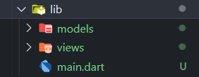
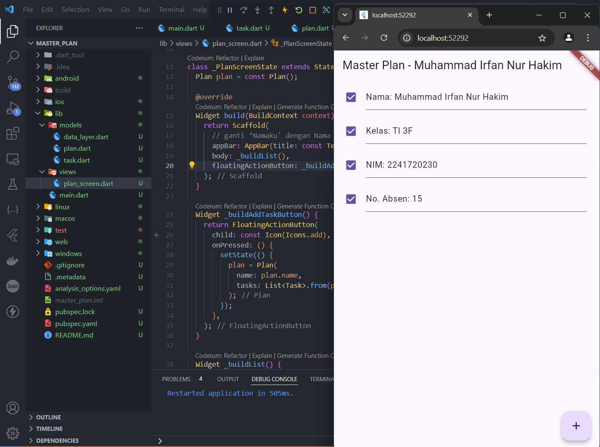
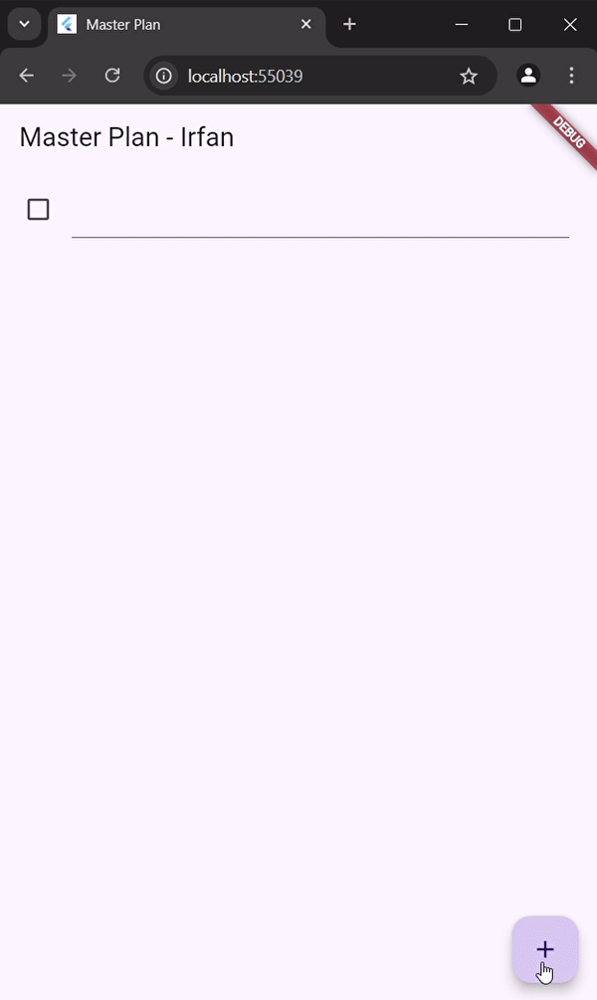
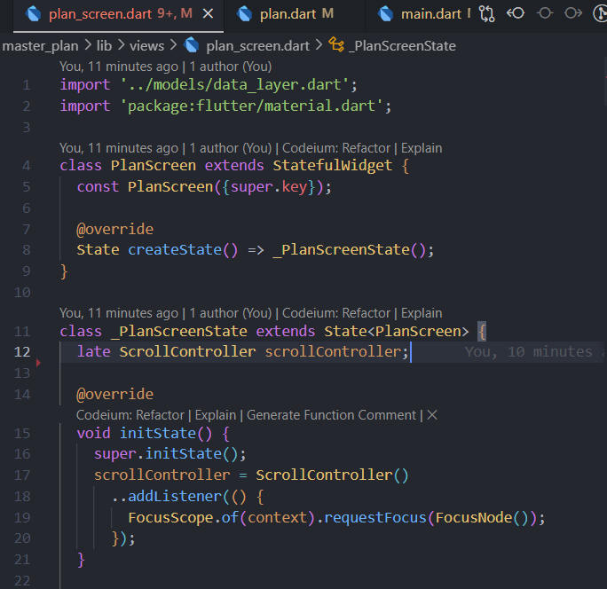
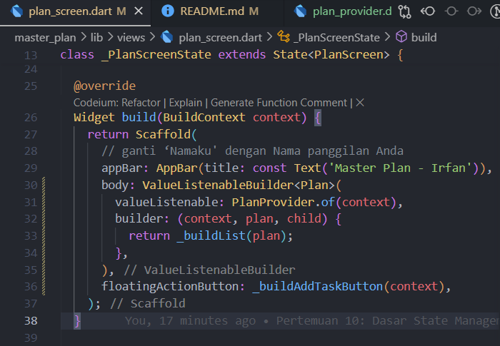
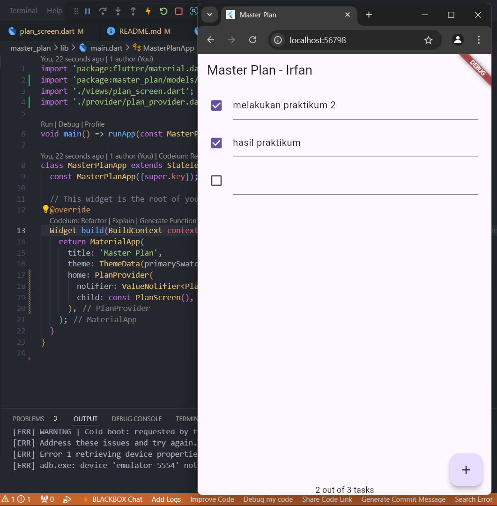
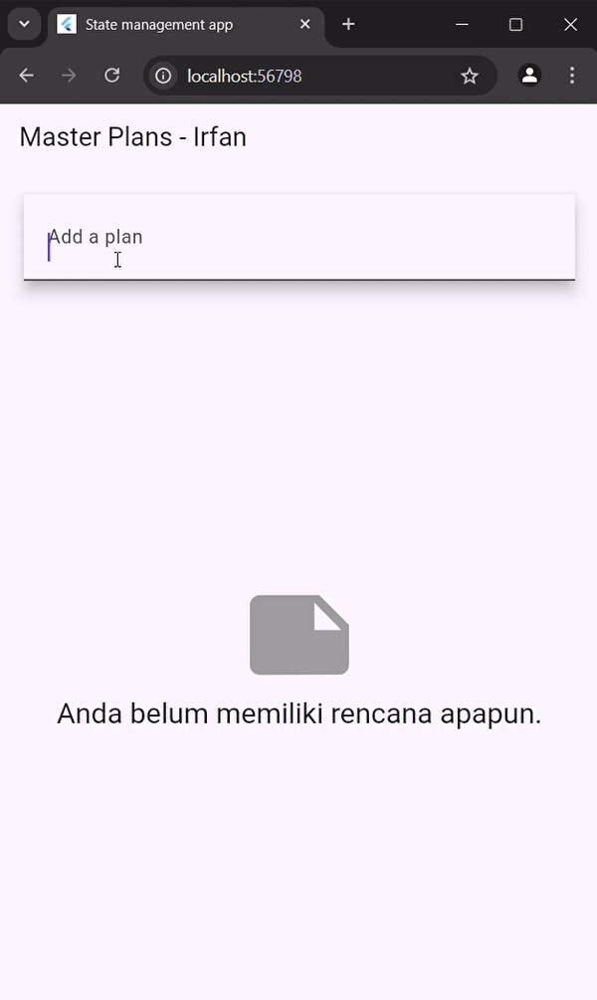
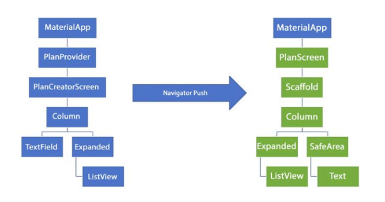

# Laporan Pertemuan 10: Dasar State Management
---

|||
|-|-|
|Nama|Muhammad Irfan Nur Hakim|
|Kelas|TI-3F|
|NIM|2241720230|
|Absen|15|
|||

## Daftar Isi:
---
```
Pertemuan 10
|
├── assets (Hasil Gambar Kode Program)
|
├── Praktikum 1: Dasar State dengan Model-View
│   └── Tugas Praktikum 1
|
├── Praktikum 2: InheritedWidget dan InheritedNotifier
│   └── Tugas Praktikum 2
|
├── Praktikum 3: Membuat State di Multiple Screens
│   └── Tugas Praktikum 3
|
└── README.md (Laporan Jobsheet)
```

## Praktikum 1: Dasar State dengan Model-View
---
### Langkah 1: Buat Project Baru
Buatlah sebuah project flutter baru dengan nama master_plan di folder src week-10 repository GitHub Anda atau sesuai style laporan praktikum yang telah disepakati. 



### Langkah 2: Membuat model task.dart
Di folder model, buat file bernama task.dart dan buat class Task.
```dart
class Task {
  final String description;
  final bool complete;
  
  const Task({
    this.complete = false,
    this.description = '',
  });
}
```

### Langkah 3: Buat file plan.dart
Buat file plan.dart di dalam folder models dan isi kode seperti berikut.
```dart
import './task.dart';

class Plan {
  final String name;
  final List<Task> tasks;
  
  const Plan({this.name = '', this.tasks = const []});
}
```

### Langkah 4: Buat file data_layer.dart
Buat file bernama data_layer.dart di folder models. Kodenya hanya berisi export seperti berikut.
```dart
export 'plan.dart';
export 'task.dart';
```

### Langkah 5: Pindah ke file main.dart
```dart
import 'package:flutter/material.dart';
import './views/plan_screen.dart';

void main() => runApp(MasterPlanApp());

class MasterPlanApp extends StatelessWidget {
  const MasterPlanApp({super.key});

  @override
  Widget build(BuildContext context) {
    return MaterialApp(
     theme: ThemeData(primarySwatch: Colors.purple),
     home: PlanScreen(),
    );
  }
}
```

### Langkah 6: buat plan_screen.dart
```dart
import '../models/data_layer.dart';
import 'package:flutter/material.dart';

class PlanScreen extends StatefulWidget {
  const PlanScreen({super.key});

  @override
  State createState() => _PlanScreenState();
}

class _PlanScreenState extends State<PlanScreen> {
  Plan plan = const Plan();

  @override
  Widget build(BuildContext context) {
   return Scaffold(
    // ganti ‘Namaku' dengan Nama panggilan Anda
    appBar: AppBar(title: const Text('Master Plan - Muhammad Irfan Nur Hakim')),
    body: _buildList(),
    floatingActionButton: _buildAddTaskButton(),
   );
  }
}
```

### Langkah 7: buat method _buildAddTaskButton()
```dart
Widget _buildAddTaskButton() {
  return FloatingActionButton(
   child: const Icon(Icons.add),
   onPressed: () {
     setState(() {
      plan = Plan(
       name: plan.name,
       tasks: List<Task>.from(plan.tasks)
       ..add(const Task()),
     );
    });
   },
  );
}
```

### Langkah 8: buat widget _buildList()
```dart
Widget _buildList() {
  return ListView.builder(
   itemCount: plan.tasks.length,
   itemBuilder: (context, index) =>
   _buildTaskTile(plan.tasks[index], index),
  );
}
```

### Langkah 9: buat widget _buildTaskTile
```dart
Widget _buildTaskTile(Task task, int index) {
    return ListTile(
      leading: Checkbox(
          value: task.complete,
          onChanged: (selected) {
            setState(() {
              plan = Plan(
                name: plan.name,
                tasks: List<Task>.from(plan.tasks)
                  ..[index] = Task(
                    description: task.description,
                    complete: selected ?? false,
                  ),
              );
            });
          }),
      title: TextFormField(
        initialValue: task.description,
        onChanged: (text) {
          setState(() {
            plan = Plan(
              name: plan.name,
              tasks: List<Task>.from(plan.tasks)
                ..[index] = Task(
                  description: text,
                  complete: task.complete,
                ),
            );
          });
        },
      ),
    );
  }
```
### Langkah 10: Tambah Scroll Controller
```dart
late ScrollController scrollController;
```

### Langkah 11: Tambah Scroll Listener
```dart
@override
void initState() {
  super.initState();
  scrollController = ScrollController()
    ..addListener(() {
      FocusScope.of(context).requestFocus(FocusNode());
    });
}
```

### Langkah 12: Tambah controller dan keyboard behavior
```dart
  Widget _buildList() {
    return ListView.builder(
      itemCount: plan.tasks.length,
      itemBuilder: (context, index) => _buildTaskTile(plan.tasks[index], index),
      controller: scrollController,
      keyboardDismissBehavior: Theme.of(context).platform == TargetPlatform.iOS
          ? ScrollViewKeyboardDismissBehavior.onDrag
          : ScrollViewKeyboardDismissBehavior.manual,
    );
  }
```

### Langkah 13: Terakhir, tambah method dispose()
```dart
@override
void dispose() {
  scrollController.dispose();
  super.dispose();
}
```

### Langkah 14: Hasil




### Tugas Praktikum 1: Dasar State dengan Model-View
---
1. Selesaikan langkah-langkah praktikum tersebut, lalu dokumentasikan berupa GIF hasil akhir praktikum beserta penjelasannya di file README.md! Jika Anda menemukan ada yang error atau tidak berjalan dengan baik, silakan diperbaiki.
2. Jelaskan maksud dari langkah 4 pada praktikum tersebut! Mengapa dilakukan demikian?
    > Jadi, Fungsi dari kode data_layer.dart adalah untuk membungkus beberapa data layer atau mengekspor kedua model Plan dan Task sehingga dapat diimpor dengan lebih mudah dan ringkas di bagian lain dari aplikasi, daripada harus mengimpor kedua model tersebut secara terpisah
3. Mengapa perlu variabel plan di langkah 6 pada praktikum tersebut? Mengapa dibuat konstanta ?
    > Variabel plan digunakan untuk menyimpan instance (plan) dari model Plan. Konstanta Plan() membuat instance plan dengan nilai default, sehingga dapat mengakses dan memanipulasi data pada model Plan di dalam widget PlanScreen. Dengan menggunakan konstanta ini, kita dapat menghindari kesalahan ketika kita belum mengisi data pada model Plan.
4. Lakukan capture hasil dari Langkah 9 berupa GIF, kemudian jelaskan apa yang telah Anda buat!
    > Pada langkah 9, kita membuat method _buildTaskTile untuk membuat ListTile untuk setiap task dalam sebuah plan. Method ini memungkinkan untuk mengubah status task dan deskripsi task dengan mudah.

    > 
5. Apa kegunaan method pada Langkah 11 dan 13 dalam lifecyle state ?
    > * Method initState() pada Langkah 11 digunakan untuk inisialisasi widget ketika pertama kali dibuat. Lalu membuat instance ScrollController dan menambahkan listener untuk menghilangkan fokus keyboard ketika pengguna scroll.
    > * Method dispose() pada Langkah 13 digunakan untuk membersihkan sumber daya yang digunakan oleh widget ketika widget sudah tidak digunakan lagi.

## Praktikum 2: Mengelola Data Layer dengan InheritedWidget dan InheritedNotifier
---
### Langkah 1: Buat file plan_provider.dart
Buat folder baru provider di dalam folder lib, lalu buat file baru dengan nama plan_provider.dart berisi kode seperti berikut.
```dart
import 'package:flutter/material.dart';
import '../models/data_layer.dart';

class PlanProvider extends InheritedNotifier<ValueNotifier<Plan>> {
  const PlanProvider({super.key, required Widget child, required
   ValueNotifier<Plan> notifier})
  : super(child: child, notifier: notifier);

  static ValueNotifier<Plan> of(BuildContext context) {
   return context.
    dependOnInheritedWidgetOfExactType<PlanProvider>()!.notifier!;
  }
}
```
### Langkah 2: Edit main.dart
Gantilah pada bagian atribut home dengan PlanProvider seperti berikut. Jangan lupa sesuaikan bagian impor jika dibutuhkan.
```dart
return MaterialApp(
  theme: ThemeData(primarySwatch: Colors.purple),
  home: PlanProvider(
    notifier: ValueNotifier<Plan>(const Plan()),
    child: const PlanScreen(),
   ),
);
```
### Langkah 3: Tambah method pada model plan.dart
Tambahkan dua method di dalam model class Plan seperti kode berikut.
```dart
int get completedCount => tasks
  .where((task) => task.complete)
  .length;

String get completenessMessage =>
  '$completedCount out of ${tasks.length} tasks';
```

### Langkah 4: Pindah ke PlanScreen
Edit PlanScreen agar menggunakan data dari PlanProvider. Hapus deklarasi variabel plan (ini akan membuat error). 



### Langkah 5: Edit method _buildAddTaskButton
Tambahkan BuildContext sebagai parameter dan gunakan PlanProvider sebagai sumber datanya. Edit bagian kode seperti berikut.
```dart
Widget _buildAddTaskButton(BuildContext context) {
  ValueNotifier<Plan> planNotifier = PlanProvider.of(context);
  return FloatingActionButton(
    child: const Icon(Icons.add),
    onPressed: () {
      Plan currentPlan = planNotifier.value;
      planNotifier.value = Plan(
        name: currentPlan.name,
        tasks: List<Task>.from(currentPlan.tasks)..add(const Task()),
      );
    },
  );
}
```

### Langkah 6: Edit method _buildTaskTile
Tambahkan parameter BuildContext, gunakan PlanProvider sebagai sumber data. Ganti TextField menjadi TextFormField untuk membuat inisial data provider menjadi lebih mudah.
```dart
Widget _buildTaskTile(Task task, int index, BuildContext context) {
  ValueNotifier<Plan> planNotifier = PlanProvider.of(context);
  return ListTile(
    leading: Checkbox(
       value: task.complete,
       onChanged: (selected) {
         Plan currentPlan = planNotifier.value;
         planNotifier.value = Plan(
           name: currentPlan.name,
           tasks: List<Task>.from(currentPlan.tasks)
             ..[index] = Task(
               description: task.description,
               complete: selected ?? false,
             ),
         );
       }),
    title: TextFormField(
      initialValue: task.description,
      onChanged: (text) {
        Plan currentPlan = planNotifier.value;
        planNotifier.value = Plan(
          name: currentPlan.name,
          tasks: List<Task>.from(currentPlan.tasks)
            ..[index] = Task(
              description: text,
              complete: task.complete,
            ),
        );
      },
    ),
  );
}
```

### Langkah 7: Edit _buildList
Sesuaikan parameter pada bagian _buildTaskTile seperti kode berikut.
```dart
Widget _buildList(Plan plan) {
   return ListView.builder(
     controller: scrollController,
     itemCount: plan.tasks.length,
     itemBuilder: (context, index) =>
        _buildTaskTile(plan.tasks[index], index, context),
   );
}
```

### Langkah 8: Tetap di class PlanScreen
Edit method build sehingga bisa tampil progress pada bagian bawah (footer).



### Langkah 9: Tambah widget SafeArea
Terakhir, tambahkan widget SafeArea dengan berisi completenessMessage pada akhir widget Column.
```dart
@override
Widget build(BuildContext context) {
   return Scaffold(
     appBar: AppBar(title: const Text('Master Plan')),
     body: ValueListenableBuilder<Plan>(
       valueListenable: PlanProvider.of(context),
       builder: (context, plan, child) {
         return Column(
           children: [
             Expanded(child: _buildList(plan)),
             SafeArea(child: Text(plan.completenessMessage))
           ],
         );
       },
     ),
     floatingActionButton: _buildAddTaskButton(context),
   );
}
```

### Hasil run:


## Tugas Praktikum 2: InheritedWidget
--- 
1. Selesaikan langkah-langkah praktikum tersebut, lalu dokumentasikan berupa GIF hasil akhir praktikum beserta penjelasannya di file README.md! Jika Anda menemukan ada yang error atau tidak berjalan dengan baik, silakan diperbaiki sesuai dengan tujuan aplikasi tersebut dibuat.
2. Jelaskan mana yang dimaksud InheritedWidget pada langkah 1 tersebut! Mengapa yang digunakan InheritedNotifier?
    > Pada langkah 1, kita menggunakan InheritedNotifier untuk membuat PlanProvider yang merupakan sebuah widget yang dapat menyimpan dan mengakses data Plan secara global dalam aplikasi Flutter. Dengan InheritedNotifier, kita dapat melakukan update data secara real-time dan mempengaruhi widget-widget lain yang bergantung pada data tersebut.
3. Jelaskan maksud dari method di langkah 3 pada praktikum tersebut! Mengapa dilakukan demikian?
    > Pada langkah 3, kita menambahkan dua method pada model Plan yaitu completedCount dan completenessMessage. 
    > * Method completedCount menghitung jumlah task yang sudah selesai dalam sebuah plan. 
    > * Method completenessMessage menghasilkan string yang menampilkan informasi tentang jumlah task yang sudah selesai dan total jumlah task dalam sebuah plan.
4. Lakukan capture hasil dari Langkah 9 berupa GIF, kemudian jelaskan apa yang telah Anda buat!
    > Pada langkah 9, kita menambahkan widget SafeArea untuk memastikan bahwa informasi tentang plan dan jumlah task tetap terlihat dan terbuka pada layar, bahkan ketika ada widget lain yang menggangu tampilan di bagian bawah layar.

    > 
5. Kumpulkan laporan praktikum Anda berupa link commit atau repository GitHub ke dosen yang telah disepakati !


## Praktikum 3: Membuat State di Multiple Screens
---
### Langkah 1: Edit PlanProvider
Edit class PlanProvider sehingga dapat menangani List Plan.
```dart
import 'package:flutter/material.dart';
import '../models/data_layer.dart';

class PlanProvider extends InheritedNotifier<ValueNotifier<List<Plan>>> {
  const PlanProvider(
      {super.key,
      required Widget child,
      required ValueNotifier<List<Plan>> notifier})
      : super(child: child, notifier: notifier);

  static ValueNotifier<List<Plan>> of(BuildContext context) {
    return context
        .dependOnInheritedWidgetOfExactType<PlanProvider>()!
        .notifier!;
  }
}
```
### Langkah 2: Edit main.dart
Langkah sebelumnya dapat menyebabkan error pada main.dart dan plan_screen.dart.
```dart
import 'package:flutter/material.dart';
import 'package:master_plan/models/plan.dart';
import './views/plan_screen.dart';
import './provider/plan_provider.dart';

void main() => runApp(const MasterPlanApp());

class MasterPlanApp extends StatelessWidget {
  const MasterPlanApp({super.key});

  @override
  Widget build(BuildContext context) {
    return PlanProvider(
      notifier: ValueNotifier<List<Plan>>(const []),
      child: MaterialApp(
        title: 'State management app',
        theme: ThemeData(
          primarySwatch: Colors.blue,
        ),
        home: const PlanScreen(),
      ),
    );
  }
}
```
### Langkah 3: Edit plan_screen.dart
Tambahkan variabel plan dan atribut pada constructor-nya 
```dart
import 'package:flutter/material.dart';
import 'package:master_plan/provider/plan_provider.dart';
import '../models/data_layer.dart';

class PlanScreen extends StatefulWidget {
  final Plan plan;
  const PlanScreen({super.key, required this.plan});

  @override
  State createState() => _PlanScreenState();
}
```
### Langkah 4: Error
Akan terjadi error setiap kali memanggil PlanProvider.of(context). Itu terjadi karena screen saat ini hanya menerima tugas-tugas untuk satu kelompok Plan, tapi sekarang PlanProvider menjadi list dari objek plan tersebut.

### Langkah 5: Tambah getter Plan
Tambahkan getter pada _PlanScreenState
```dart
class _PlanScreenState extends State<PlanScreen> {
  late ScrollController scrollController;
  Plan get plan => widget.plan;
  
```

### Langkah 6: Method initState()
Pada bagian ini kode tetap
```dart
class _PlanScreenState extends State<PlanScreen> {
  late ScrollController scrollController;
  Plan get plan => widget.plan;
  
  @override
  void initState() {
    super.initState();
    scrollController = ScrollController()
      ..addListener(() {
        FocusScope.of(context).requestFocus(FocusNode());
      });
  }
```
### Langkah 7: Widget build
Pastikan telah merubah ke List dan mengubah nilai pada currentPlan
```dart
  @override
  Widget build(BuildContext context) {
    ValueNotifier<List<Plan>> plansNotifier = PlanProvider.of(context);

    return Scaffold(
      appBar: AppBar(title: Text(_plan.name)),
      body: ValueListenableBuilder<List<Plan>>(
        valueListenable: plansNotifier,
        builder: (context, plans, child) {
          Plan currentPlan = plans.firstWhere((p) => p.name == plan.name);
          return Column(
            children: [
              Expanded(child: _buildList(currentPlan)),
              SafeArea(child: Text(currentPlan.completenessMessage)),
            ],
          );
        },
      ),
      floatingActionButton: _buildAddTaskButton(
        context,
      ),
    );
  }

  Widget _buildAddTaskButton(BuildContext context) {
    ValueNotifier<List<Plan>> planNotifier = PlanProvider.of(context);
    return FloatingActionButton(
      child: const Icon(Icons.add),
      onPressed: () {
        Plan currentPlan = plan;
        int planIndex =
            planNotifier.value.indexWhere((p) => p.name == currentPlan.name);
        List<Task> updatedTasks = List<Task>.from(currentPlan.tasks)
          ..add(const Task());
        planNotifier.value = List<Plan>.from(planNotifier.value)
          ..[planIndex] = Plan(
            name: currentPlan.name,
            tasks: updatedTasks,
          );
        plan = Plan(
          name: currentPlan.name,
          tasks: updatedTasks,
        );
      },
    );
  }
```

### Langkah 8: Edit _buildTaskTile
Pastikan ubah ke List dan variabel planNotifier
```dart
Widget _buildTaskTile(Task task, int index, BuildContext context) {
    ValueNotifier<List<Plan>> planNotifier = PlanProvider.of(context);

    return ListTile(
      leading: Checkbox(
          value: task.complete,
          onChanged: (selected) {
            Plan currentPlan = plan;
            int planIndex = planNotifier.value
                .indexWhere((p) => p.name == currentPlan.name);
            planNotifier.value = List<Plan>.from(planNotifier.value)
              ..[planIndex] = Plan(
                name: currentPlan.name,
                tasks: List<Task>.from(currentPlan.tasks)
                  ..[index] = Task(
                    description: task.description,
                    complete: selected ?? false,
                  ),
              );
          }),
      title: TextFormField(
        initialValue: task.description,
        onChanged: (text) {
          Plan currentPlan = plan;
          int planIndex =
              planNotifier.value.indexWhere((p) => p.name == currentPlan.name);
          planNotifier.value = List<Plan>.from(planNotifier.value)
            ..[planIndex] = Plan(
              name: currentPlan.name,
              tasks: List<Task>.from(currentPlan.tasks)
                ..[index] = Task(
                  description: text,
                  complete: task.complete,
                ),
            );
        },
      ),
    );
  }
```

### Langkah 9: Buat screen baru
Pada folder view, buatlah file baru dengan nama plan_creator_screen.dart dan deklarasikan dengan StatefulWidget bernama PlanCreatorScreen.

Berikut pada main.dart:
```dart
@override
  Widget build(BuildContext context) {
    return PlanProvider(
      notifier: ValueNotifier<List<Plan>>(const []),
      child: MaterialApp(
        title: 'State management app',
        theme: ThemeData(
          primarySwatch: Colors.blue,
        ),
        home: const PlanCreatorScreen(),
      ),
    );
  }
```

### Langkah 10: Pindah ke class _PlanCreatorScreenState
Menambahkan variabel TextEditingController sehingga bisa membuat TextField sederhana untuk menambah Plan baru dan menambahkan dispose ketika widget unmounted.
```dart
class _PlanCreatorScreenState extends State<PlanCreatorScreen> {
  final textController = TextEditingController();

  @override
  void dispose() {
    textController.dispose();
    super.dispose();
  }

  @override
  Widget build(BuildContext context) {
    return const Placeholder();
  }
}
```

### Langkah 11: Pindah ke method build
Menambahkan Widget Scaffold
```dart
  @override
  Widget build(BuildContext context) {
    return Scaffold(
      // ganti ‘Namaku' dengan nama panggilan Anda
      appBar: AppBar(title: const Text('Master Plans - Irfan')),
      body: Column(children: [
        _buildListCreator(),
        Expanded(child: _buildMasterPlans())
      ]),
    );
  }
```
### Langkah 12: Buat widget _buildListCreator
Membuat widget _buildListCreator
```dart
  Widget _buildListCreator() {
    return Padding(
        padding: const EdgeInsets.all(20.0),
        child: Material(
          color: Theme.of(context).cardColor,
          elevation: 10,
          child: TextField(
              controller: textController,
              decoration: const InputDecoration(
                  labelText: 'Add a plan', contentPadding: EdgeInsets.all(20)),
              onEditingComplete: addPlan),
        ));
  }
```
### Langkah 13: Buat void addPlan()
Membuat void addPlan() untuk menambahkan Plan baru
```dart
  void addPlan() {
    final text = textController.text;
    if (text.isEmpty) {
      return;
    }
    final plan = Plan(name: text, tasks: []);
    ValueNotifier<List<Plan>> planNotifier = PlanProvider.of(context);
    planNotifier.value = List<Plan>.from(planNotifier.value)..add(plan);
    textController.clear();
    FocusScope.of(context).requestFocus(FocusNode());
    setState(() {});
  }
```
### Langkah 14: Buat widget _buildMasterPlans()
Membuat widget _buildMasterPlans
```dart
Widget _buildMasterPlans() {
    ValueNotifier<List<Plan>> planNotifier = PlanProvider.of(context);
    List<Plan> plans = planNotifier.value;

    if (plans.isEmpty) {
      return Column(
        mainAxisAlignment: MainAxisAlignment.center,
        children: <Widget>[
          const Icon(Icons.note, size: 100, color: Colors.grey),
          Text(
            'Anda belum memiliki rencana apapun.',
            style: Theme.of(context).textTheme.headlineSmall,
          ),
        ],
      );
    }
    return ListView.builder(
      itemCount: plans.length,
      itemBuilder: (context, index) {
        final plan = plans[index];
        return ListTile(
          title: Text(plan.name),
          subtitle: Text(plan.completenessMessage),
          onTap: () {
            Navigator.of(context).push(
              MaterialPageRoute(
                builder: (_) => PlanScreen(
                  plan: plan,
                ),
              ),
            );
          },
        );
      },
    );
  }
```

### Hasil run:



## Tugas Praktikum 3: State di Multiple Screens
---
1. Selesaikan langkah-langkah praktikum tersebut, lalu dokumentasikan berupa GIF hasil akhir praktikum beserta penjelasannya di file README.md! Jika Anda menemukan ada yang error atau tidak berjalan dengan baik, silakan diperbaiki sesuai dengan tujuan aplikasi tersebut dibuat.
2. Berdasarkan Praktikum 3 yang telah Anda lakukan, jelaskan maksud dari gambar diagram berikut ini!

    > Layar PlanCreatorScreen (kiri) itu Menampilkan input teks dan daftar item, sedangkan pada Layar PlanScreen (kanan) itu ditampilkan setelah navigasi dari layar pertama menggunakan Navigator.push. 

    > Jadi Navigator.push digunakan untuk memindahkan pengguna dari PlanCreatorScreen (kiri) ke PlanScreen (kanan). Perpindahan ini mengubah tampilan dari layar input data rencana menjadi layar yang menampilkan daftar atau detail rencana. Sehingga pengguna dapat memasukkan informasi rencana pada layar pertama, lalu melihat daftar rencana yang telah dibuat atau detail rencana pada layar berikutnya.


3. Lakukan capture hasil dari Langkah 14 berupa GIF, kemudian jelaskan apa yang telah Anda buat!
    > Pada langkah 14, kita membuat sebuah method _buildMasterPlans yang digunakan untuk membuat sebuah widget yang menampilkan daftar rencana (plan) yang ada dan mengakses detail rencana dengan mudah.

    > 
4. Kumpulkan laporan praktikum Anda berupa link commit atau repository GitHub ke dosen yang telah disepakati !


