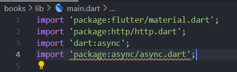
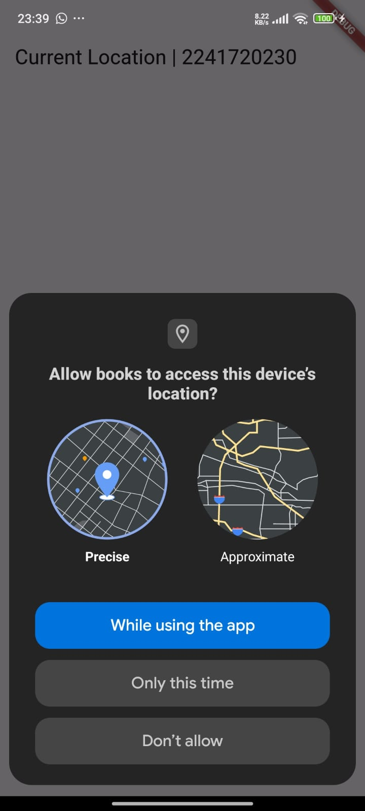

# Laporan Pertemuan 11: Pemrograman Asynchronous di Flutter
---

|||
|-|-|
|Nama|Muhammad `Irfan` Nur Hakim|
|Kelas|TI-3F|
|NIM|2241720230|
|Absen|15|
|||

## Daftar Isi:
---
```
Pertemuan 11 | Pemrograman Asynchronous
|
|─── books | Kode Program
|    |
|    ├── Praktikum 1: Mengunduh Data dari Web Service (API)
|    |
|    ├── Praktikum 2: Menggunakan await/async untuk menghindari callbacks
|    |
|    ├── Praktikum 3: Menggunakan Completer di Future
|    |
|    ├── Praktikum 4: Memanggil Future secara paralel
|    |
|    ├── Praktikum 5: Menangani Respon Error pada Async Code
|    |
|    ├── Praktikum 6: Menggunakan Future dengan StatefulWidget
|    |
|    ├── Praktikum 7: Manajemen Future dengan FutureBuilder
|    |
|    ├── Praktikum 8: Navigation route dengan Future Function
|    |
|    └── Praktikum 9: Memanfaatkan async/await dengan Widget Dialog
|
├── assets | Hasil Gambar Kode Program
|
└── README.md | Laporan Jobsheet
```


## Praktikum 1: Mengunduh Data dari Web Service (API)
---
### Langkah 1: Membuat Project Baru
Membuat project baru dengan nama `books` dan menambahkan dependencies `http`.

### Langkah 2: Cek file pubspec.yaml
Memastikan file `pubspec.yaml` sudah terdapat dependencies `http`.


### Langkah 3: Buka file main.dart

### `Soal 1`
Tambahkan nama panggilan Anda pada title app sebagai identitas hasil pekerjaan Anda.
```dart
import 'package:flutter/material.dart';
import 'package:http/http.dart';
import 'dart:async';

void main() {
  runApp(const MyApp());
}

class MyApp extends StatelessWidget {
  const MyApp({super.key});

  @override
  Widget build(BuildContext context) {
    return MaterialApp(
      title: 'Aplikasi Buku - Irfan | 2241720230',
      theme: ThemeData(
        primarySwatch: Colors.blue,
        visualDensity: VisualDensity.adaptivePlatformDensity,
      ),
      home: const FuturePage(),
    );
  }
}

class FuturePage extends StatefulWidget {
  const FuturePage({super.key});

  @override
  _FuturePageState createState() => _FuturePageState();
}

class _FuturePageState extends State<FuturePage> {
  String result = '';
  @override
  Widget build(BuildContext context) {
    return Scaffold(
      appBar: AppBar(
        title: const Text('Aplikasi Buku - Irfan | 2241720230'),
      ),
      body: Center(
        child: Column(
          children: [
            const Spacer(),
            ElevatedButton(child: const Text('GO!'), onPressed: () {}),
            const Spacer(),
            Text(result),
            const Spacer(),
            const CircularProgressIndicator(),
            const Spacer(),
          ],
        ),
      ),
    );
  }
}

```

# Langkah 4: Tambah method getData()

Menambahkan method `getData()` untuk mengambil data dari web service.


## `Soal 2`

Carilah judul buku favorit Anda di Google Books, lalu ganti ID buku pada variabel path di kode tersebut.


# Langkah 5: Tambah kode di ElevatedButton

Menambahkan kode untuk memanggil method `getData()` pada ElevatedButton.


## `Soal 3`

Jelaskan maksud kode langkah 5 tersebut terkait `substring` dan `catchError`!

Capture hasil praktikum Anda berupa GIF dan lampirkan di README.

> `substring` digunakan untuk mengambil data dengan membatasi jumlah data yang ditampilkan di layar, yaitu hanya 450 karakter pertama. Sedangkan, `catchError` digunakan untuk menangani kesalahan yang terjadi saat mengambil data.


## Praktikum 2: Menggunakan await/async untuk menghindari callbacks
---
### Langkah 1: Buka file main.dart
Tambahkan tiga method berisi kode seperti berikut di dalam class _FuturePageState.

```dart
  Future<Response> getData() async {
    const authority = 'www.googleapis.com';
    const path = '/books/v1/volumes/zA36EAAAQBAJ';

    Uri url = Uri.https(authority, path);
    return await get(url);
  }
  Future<int> returnOneAsync() async {
    await Future.delayed(const Duration(seconds: 3));
    return 1;
  }

  Future<int> returnTwoAsync() async {
    await Future.delayed(const Duration(seconds: 3));
    return 2;
  }

  Future<int> returnThreeAsync() async {
    await Future.delayed(const Duration(seconds: 3));
    return 3;
  }
```
### Langkah 2: Tambah method count()
Menambahkan method count() untuk menghitung.
```dart
  Future count() async {
    int total = 0;
    total = await returnOneAsync();
    total += await returnTwoAsync();
    total += await returnThreeAsync();
    setState(() {
      result = total.toString();
    });
  }
```
### Langkah 3: Panggil count()
Menambahkan kode untuk memanggil method count() pada ElevatedButton.


### Langkah 4: Run
Menjalankan aplikasi.


### `Soal 4`
Jelaskan maksud kode langkah 1 dan 2 tersebut!

Capture hasil praktikum Anda berupa GIF dan lampirkan di README. Lalu lakukan commit dengan pesan "W12: Soal 4".

Jawaban
Kode langkah 1 adalah kode yang akan mengembalikan nilai 1,2,3 dengan delay 3 detik. Kode langkah 2 adalah kode yang akan menjalankan kode langkah 1 dan menampilkan hasilnya.


## Praktikum 3: Menggunakan Completer di Future
---
### Langkah 1: Buka main.dart

Melakukan import package async.



### Langkah 2: Tambahkan variabel dan method

Menambahkan variabel late dan method di class _FuturePageState.


### Langkah 3: Ganti isi kode onPressed()

Mengganti isi kode onPressed() pada ElevatedButton.
```dart
ElevatedButton(
              child: const Text('GO!'),
              onPressed: () async {
                getNumber().then((value) {
                  setState(() {
                    result = value.toString();
                  });
                });
              },
            ),
```
### Langkah 4: Run


## `Soal 5`

Jelaskan maksud kode langkah 2 tersebut!

Capture hasil praktikum Anda berupa GIF dan lampirkan di README.

### Jawaban

Kode tersebut menggunakan Completer untuk mengelola penyelesaian (completion) dari sebuah Future secara manual.

Mendeklarasikan variabel completer dengan keyword late, yang berarti variabel akan diinisialisasi nanti sebelum digunakan.

Fungsi `getNumber()` membuat instance baru dari `Completer<int>()`.
Memanggil fungsi `calculate()` yang akan menyelesaikan Completer tersebut.
Mengembalikan `completer.future`, yaitu sebuah Future yang akan berisi nilai ketika completer selesai (complete).


### Langkah 5: Ganti method calculate()

Mengganti atau membuat calculate2().

```dart
  Future calculate() async {
    try {
      await new Future.delayed(const Duration(seconds: 5));
      completer.complete(42);
    } catch (_) {
      completer.completeError({});
    }
  }
```

### Langkah 6: Pindah ke onPressed()

Mengganti isi kode onPressed() pada ElevatedButton.
```dart
            ElevatedButton(
              child: const Text('GO!'),
              onPressed: () async {
                getNumber().then((value) {
                  setState(() {
                    result = value.toString();
                  });
                }).catchError((e) {
                  result = 'An error occurred';
                });
              },
            ),
```
## `Soal 6`
Jelaskan maksud perbedaan kode langkah 2 dengan langkah 5-6 tersebut!

Capture hasil praktikum Anda berupa GIF dan lampirkan di README. 

### Jawaban

Kode langkah 2 menggunakan Completer untuk mengelola penyelesaian (completion) dari sebuah Future secara manual tanpa melakukan handle jika terjadi error. 

Sedangkan kode langkah 5-6 menggunakan Completer dengan Future.delayed untuk menunda eksekusi kode selama 5 detik dan menerapkan try-catch untuk menangkap error yang terjadi dan completer.completeError() untuk menyelesaikan Completer dengan error.


## Praktikum 4: Memanggil Future secara paralel
---
### Langkah 1: Buka file main.dart

Menambahkan method returnFG ke dalam class _FuturePageState.

```dart
void returnFG() {
    FutureGroup<int> futureGroup = FutureGroup();
    futureGroup.add(returnOneAsync());
    futureGroup.add(returnTwoAsync());
    futureGroup.add(returnThreeAsync());
    futureGroup.close();
    futureGroup.future.then((List<int> value) {
      int total = 0;
      for (var element in value) {
        total += element;
      }
      setState(() {
        result = total.toString();
      });
    });
  }
```

### Langkah 2: Edit onPressed()

Mengedit kode onPressed() pada ElevatedButton.


### Langkah 3: Run

Hasilnya dalam 3 detik berupa angka 6 lebih cepat dibandingkan praktikum sebelumnya menunggu sampai 9 detik.

## `Soal 7`

Capture hasil praktikum Anda berupa GIF dan lampirkan di README

### Jawaban


### Langkah 4: Ganti variabel futureGroup

Mengganti variabel futureGroup dengan `Future.wait`.

```dart
final futures = Future.wait<int>([
  returnOneAsync(),
  returnTwoAsync(),
  returnThreeAsync(),
]);
```
## `Soal 8`

Jelaskan maksud perbedaan kode langkah 1 dan 4!

### Jawaban

Kode langkah 1 menggunakan FutureGroup untuk mengelola beberapa Future secara paralel. Sedangkan kode langkah 4 menggunakan Future.wait untuk menjalankan beberapa Future secara paralel dan mengembalikan Future yang akan menyelesaikan ketika semua Future selesai.

Keduanya digunakan untuk menunggu beberapa Future selesai, tetapi FutureGroup memberikan fleksibilitas lebih dalam menambahkan Future secara dinamis


## Praktikum 5: Menangani Respon Error pada Async Code
---

### Langkah 1: Buka file main.dart

Menambahkan method `returnError` ke dalam class _FuturePageState.

```dart
  Future returnError() async {
    await Future.delayed(const Duration(seconds: 2));
    throw Exception('Something terrible happened!');
  }
```
### Langkah 2: ElevatedButton
Ubah kode onPressed() pada ElevatedButton.


### Langkah 3: Run

Menjalankan aplikasi.


## Soal 9

Capture hasil praktikum Anda berupa GIF dan lampirkan di README.


### Langkah 4: Tambah method handleError()

Menambahkan method `handleError` ke dalam class _FuturePageState.


## Soal 10

Panggil method handleError() tersebut di ElevatedButton, lalu run. Apa hasilnya? Jelaskan perbedaan kode langkah 1 dan 4!

## Jawaban

Hasilnya akan menampilkan `complete` pada console. Perbedaan kode langkah 1 dan 4 adalah kode langkah 1 menggunakan catchError untuk menangkap error yang terjadi pada kode dan onComplete untuk menampilkan hasilnya di console. Sedangkan kode langkah 4 menggunakan try-catch pada method `returnError` untuk menangkap error yang terjadi dan menggunakan finally untuk menampilkan hasilnya di console.

## Praktikum 6: Menggunakan Future dengan StatefulWidget
---

### Langkah 1: install plugin geolocator

Menambahkan dependencies geolocator.


### Langkah 2: Tambah permission GPS

Menambahkan permission GPS.


### Langkah 3: Buat file geolocation.dart

Membuat file geolocation.dart.

### Langkah 4: Buat StatefulWidget

Buat class LocationScreen di dalam file geolocation.dart.

```dart
import 'package:flutter/material.dart';

class LocationScreen extends StatefulWidget {
  const LocationScreen({super.key});

  @override
  State<LocationScreen> createState() => _LocationScreenState();
}

class _LocationScreenState extends State<LocationScreen> {
  @override
  Widget build(BuildContext context) {
    return const Placeholder();
  }
}
```

### Langkah 5: Isi kode geolocation.dart

Isi kode di dalam class LocationScreen.

```dart
import 'package:flutter/material.dart';
import 'package:geolocator/geolocator.dart';

class LocationScreen extends StatefulWidget {
  const LocationScreen({super.key});

  @override
  State<LocationScreen> createState() => _LocationScreenState();
}

class _LocationScreenState extends State<LocationScreen> {
  String myPosition = '';
  @override
  void initState() {
    super.initState();
    getPosition().then((Position myPos) {
      myPosition =
          'Latitude: ${myPos.latitude.toString()}, Longitude: ${myPos.longitude.toString()}';
      setState(() {
        myPosition = myPosition;
      });
    });
  }

  @override
  Widget build(BuildContext context) {
    return Scaffold(
      appBar: AppBar(title: const Text("Current Location | 2241720230")),
      body: Center(child: Text(myPosition)),
    );
  }

  Future<Position> getPosition() async {
    await Geolocator.requestPermission();
    await Geolocator.isLocationServiceEnabled();
    Position? position = await Geolocator.getCurrentPosition();
    return position;
  }
}
```

## Soal 11
Tambahkan nama panggilan Anda pada tiap properti title sebagai identitas pekerjaan Anda.
> Saya menggunaakn nim saya yaitu 2241720230
```dart
  Widget build(BuildContext context) {
    return Scaffold(
      appBar: AppBar(title: const Text("Current Location | 2241720230")),
      body: Center(child: Text(myPosition)),
    );
  }
```
### Langkah 6: Edit main.dart

Panggil screen baru tersebut di file main.dart.

```dart
class MyApp extends StatelessWidget {
  const MyApp({super.key});

  @override
  Widget build(BuildContext context) {
    return MaterialApp(
      title: 'Aplikasi Buku - Irfan | 2241720230',
      theme: ThemeData(
        primarySwatch: Colors.blue,
        visualDensity: VisualDensity.adaptivePlatformDensity,
      ),
      home: LocationScreen(),
    );
  }
}
```

### Langkah 7: Run

Menjalankan aplikasi.




### Langkah 8: Tambahkan animasi loading

Menambahkan animasi loading.

```dart
  @override
  Widget build(BuildContext context) {
    final myWidget =
        myPosition == '' ? const CircularProgressIndicator() : Text(myPosition);
    return Scaffold(
      appBar:
          AppBar(title: const Text("Current Location | 2241720230 - Irfan")),
      body: Center(child: myWidget),
    );
  }
```

## Soal 12
Jika Anda tidak melihat animasi loading tampil, kemungkinan itu berjalan sangat cepat. Tambahkan delay pada method getPosition() dengan kode await Future.delayed(const Duration(seconds: 3));

Apakah Anda mendapatkan koordinat GPS ketika run di browser? Mengapa demikian?

Capture hasil praktikum Anda berupa GIF dan lampirkan di README.

## Jawaban

Menambahkan delay pada method getPosition() dengan kode `await Future.delayed(const Duration(seconds: 3));`.


Saya mendapatkan koordinat GPS ketika run di browser. Hal ini dikarenakan browser memiliki akses ke GPS sehingga dapat menampilkan koordinat GPS.

Hasil run di browser:


Hasil run di device:


## Praktikum 7: Manajemen Future dengan FutureBuilder
---

## Praktikum 8: Navigation route dengan Future Function
---

## Praktikum 9: Memanfaatkan async/await dengan Widget Dialog
---

   

