# Laporan Pertemuan 12: Lanjutan State Management dengan Streams

---

|||
|-|-|
|Nama|Muhammad `Irfan` Nur Hakim|
|Kelas|TI-3F|
|NIM|2241720230|
|Absen|15|
|||

## Daftar Isi

---
```
Pertemuan 12 | Streams
|
|─── books | Kode Program
|    |
|    ├── Praktikum 1: Dart Streams
|    |
|    ├── Praktikum 2: Stream controller dan sinks
|    |
|    ├── Praktikum 3: Injeksi data ke streams
|    |
|    ├── Praktikum 4: Subscribe ke stream events
|    |
|    ├── Praktikum 5: Multiple stream subscriptions
|    |
|    ├── Praktikum 6: StreamBuilder
|    |
|    └── Praktikum 7: BLoC Pattern
|
├── assets | Hasil Gambar Kode Program
|
└── README.md | Laporan Jobsheet
```

## Praktikum 1: Dart Streams

---

### Langkah 1: Membuat Project Baru

Membuat sebuah project flutter baru dengan nama stream_nama (beri nama panggilan Anda) di folder week-12/src/ 

### Langkah 2: Buka file main.dart

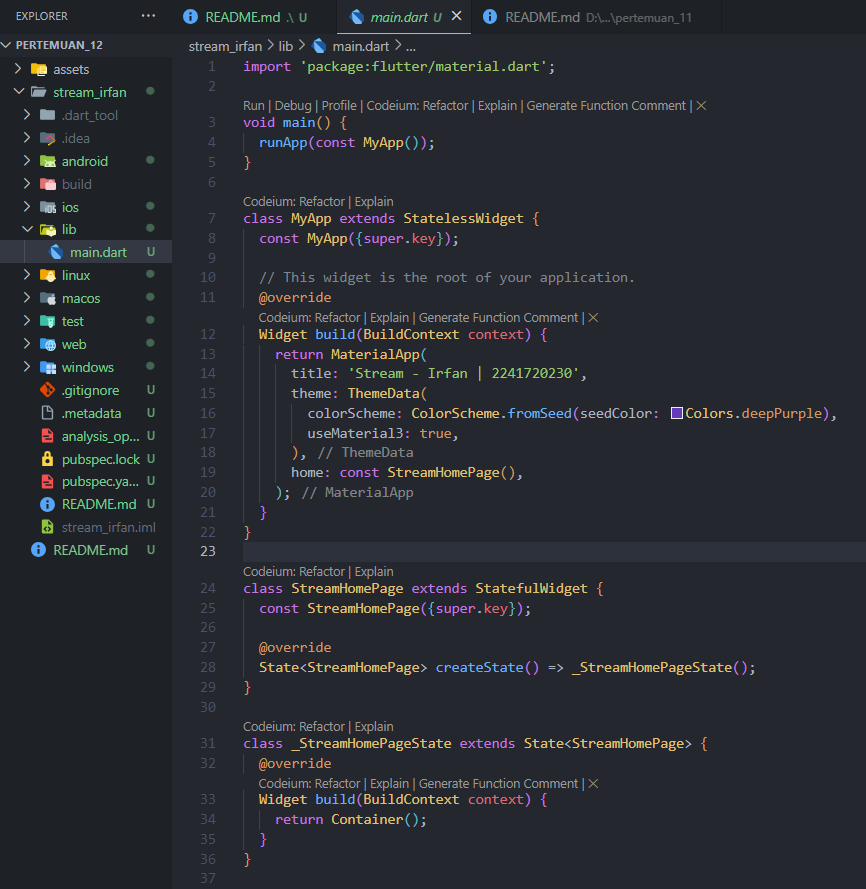


### `Soal 1`

Tambahkan nama panggilan Anda pada title app sebagai identitas hasil pekerjaan Anda.
Gantilah warna tema aplikasi sesuai kesukaan Anda.
Lakukan commit hasil jawaban Soal 1 dengan pesan "W12: Jawaban Soal 1"
> 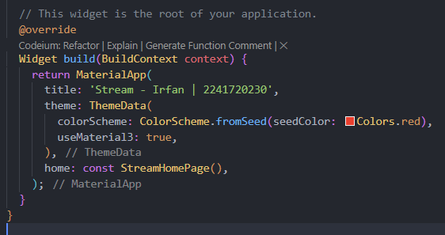

### Langkah 3: Membuat file baru stream.dart

Buat file baru di folder lib project Anda. Lalu isi dengan kode berikut.

### Langkah 4: Tambah variabel colors

```dart
import 'package:flutter/material.dart';

class ColorStream  {
  final List<Color> colors = [
    Colors.blueGrey, 
    Colors.amber, 
    Colors.deepPurple,
    Colors.lightBlue,
    Colors.teal,
  ];
}
```

### `Soal 2`

Tambahkan 5 warna lainnya sesuai keinginan Anda pada variabel colors tersebut.
Lakukan commit hasil jawaban Soal 2 dengan pesan "W12: Jawaban Soal 2"

> 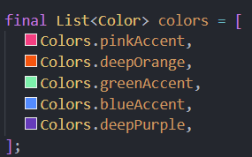

### Langkah 5: Tambah method getColors()

```dart
  Stream<Color> getColors() async* {
  }
```

### Langkah 6: Tambah perintah yield*

```dart
  Stream<Color> getColors() async* {
    yield* Stream.periodic(const Duration(seconds: 1), (int t) {
      int index = t % colors.length;
      return colors[index];
    });
  }
```

### `Soal 3`

Jelaskan fungsi keyword yield* pada kode tersebut!
> Fungsi keyword yield* pada kode tersebut adalah untuk mengembalikan nilai dari sebuah fungsi generator. Fungsi generator adalah fungsi yang menghasilkan nilai secara berurutan. Fungsi generator menggunakan kata kunci yield untuk mengembalikan nilai.

Apa maksud isi perintah kode tersebut?
> Maksud dari isi perintah kode tersebut adalah untuk mengembalikan nilai dari sebuah fungsi generator yang berisi list warna yang telah didefinisikan sebelumnya.

Lakukan commit hasil jawaban Soal 3 dengan pesan "W12: Jawaban Soal 3"

### Langkah 7: Buka main.dart
Ketik kode impor file ini pada file main.dart
```dart
import 'stream.dart';
```
### Langkah 8: Tambah variabel
Ketik dua properti ini di dalam class _StreamHomePageState
```dart
  Color bgColor = Colors.blueGrey;
  late ColorStream colorStream;
```

### Langkah 9: Tambah method changeColor()
Tetap di file main, Ketik kode seperti berikut
```dart
  void changeColor() async {
    await for (var eventColor in colorStream.getColors()) {
      setState(() {
        bgColor = eventColor;
      });
    }
  }
```
### Langkah 10: Lakukan override initState()
Ketika kode seperti berikut
```dart
  @override
  void initState() {
    super.initState();
    colorStream = ColorStream();
    changeColor();
  }
```
### Langkah 11: Ubah isi Scaffold()
Sesuaikan kode seperti berikut.
```dart
  @override
  Widget build(BuildContext context) {
    return Scaffold(
      appBar: AppBar(
        title: const Text('Stream - Irfan | 2241720230'),
      ),
      body: Container(
        decoration: BoxDecoration(color: bgColor),
      ),
    );
  }
```
### Langkah 12: Run
Lakukan running pada aplikasi Flutter Anda, maka akan terlihat berubah warna background setiap detik.

### `Soal 4`
Capture hasil praktikum Anda berupa GIF dan lampirkan di README.
Lakukan commit hasil jawaban Soal 4 dengan pesan "W12: Jawaban Soal 4"

> 

### Langkah 13: Ganti isi method changeColor()
Anda boleh comment atau hapus kode sebelumnya, lalu ketika kode seperti berikut.

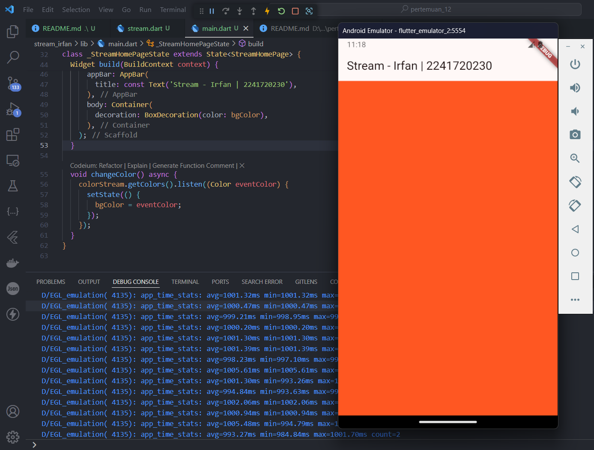

### `Soal 5`
Jelaskan perbedaan menggunakan listen dan await for (langkah 9) !
> * listen itu digunakan untuk mendengarkan perubahan pada stream yang diberikan. Ketika stream tersebut mengeluarkan data, maka listen akan mengeksekusi kode yang ada di dalamnya.
> * await for itu digunakan untuk menunggu stream yang diberikan mengeluarkan data. Ketika stream tersebut mengeluarkan data, maka await for akan mengeksekusi kode yang ada di dalamnya.

Lakukan commit hasil jawaban Soal 5 dengan pesan "W12: Jawaban Soal 5"


## Praktikum 2: Dart Streams

---

### Langkah 1: Buka file stream.dart
Lakukan impor dengan mengetik kode ini.
```dart
import 'dart:async';
```

### Langkah 2: Tambah class NumberStream
Tetap di file stream.dart tambah class baru seperti berikut.
```dart
class NumberStream {
}
```

### Langkah 3: Tambah StreamController
Di dalam class NumberStream buatlah variabel seperti berikut.
```dart
class NumberStream {
  final StreamController<int> controller = StreamController<int>();
}
```

### Langkah 4: Tambah method addNumberToSink
Tetap di class NumberStream buatlah method ini

```dart
  void addNumberToSink(int newNumber) {
    controller.sink.add(newNumber);
  }
```

### Langkah 5: Tambah method close()
Tetap di class NumberStream buatlah method ini
```dart
  close(){
    controller.close();
  }
```

### Langkah 6: Buka main.dart
```dart
import 'dart:async';
import 'dart:math';
```

### Langkah 7: Tambah variable
Di dalam class _StreamHomePageState ketik variabel berikut
```dart
  int lastNumber = 0;
  late StreamController numberStreamController;
  late NumberStream numberStream;
```
### Langkah 8: Edit initState()
```dart
  @override
  void initState() {
    numberStream = NumberStream();
    numberStreamController = numberStream.controller;
    Stream stream = numberStreamController.stream;

    stream.listen((event) {
      setState(() {
        lastNumber = event;
      });
    });
    super.initState();
  }
```
### Langkah 9: Edit dispose()
```dart
  @override
  void dispose() {
    numberStreamController.close();
    super.dispose();
  }
```

### Langkah 10: Tambah method addRandomNumber()
```dart
void addRandomNumber() {
  Random random = Random();
  int myNum = random.nextInt(10);
  numberStream.addNumberToSink(myNum);
}
```
### Langkah 11: Edit method build()
```dart
import 'package:flutter/material.dart';
import 'stream.dart';
import 'dart:async';
import 'dart:math';

void main() {
  runApp(const MyApp());
}

class MyApp extends StatelessWidget {
  const MyApp({super.key});

  // This widget is the root of your application.
  @override
  Widget build(BuildContext context) {
    return MaterialApp(
      title: 'Stream - Irfan | 2241720230',
      theme: ThemeData(
        primarySwatch: Colors.blue,
      ),
      home: const StreamHomePage(),
    );
  }
}

class StreamHomePage extends StatefulWidget {
  const StreamHomePage({super.key});

  @override
  State<StreamHomePage> createState() => _StreamHomePageState();
}

class _StreamHomePageState extends State<StreamHomePage> {
  Color bgColor = Colors.blueGrey;
  late ColorStream colorStream;

  int lastNumber = 0;
  late StreamController numberStreamController;
  late NumberStream numberStream;

  @override
  void initState() {
    numberStream = NumberStream();
    numberStreamController = numberStream.controller;
    Stream stream = numberStreamController.stream;

    stream.listen((event) {
      setState(() {
        lastNumber = event;
      });
    });
    super.initState();
  }

  @override
  void dispose() {
    numberStreamController.close();
    super.dispose();
  }

  @override
  Widget build(BuildContext context) {
    return Scaffold(
        appBar: AppBar(
          title: const Text('Stream - Irfan | 2241720230'),
        ),
        body: SizedBox(
          width: double.infinity,
          child: Column(
            mainAxisAlignment: MainAxisAlignment.spaceEvenly,
            crossAxisAlignment: CrossAxisAlignment.center,
            children: [
              Text(lastNumber.toString()),
              ElevatedButton(
                  onPressed: () => addRandomNumber(),
                  child: const Text('New Random Number'))
            ],
          ),
        ));
  }

  void addRandomNumber() {
    Random random = Random();
    int myNum = random.nextInt(10);
    numberStream.addNumberToSink(myNum);
  }

  void changeColor() async {
    ColorStream colorStream = ColorStream();
    colorStream.getColors().listen((Color color) {
      setState(() {
        bgColor = color;
      });
    });
  }
}
```

### Langkah 12: Run
Lakukan running pada aplikasi Flutter Anda, maka akan terlihat seperti gambar berikut.

### `Soal 6`
* Jelaskan maksud kode langkah 8 dan 10 tersebut!
* Capture hasil praktikum Anda berupa GIF dan lampirkan di README.
* Lalu lakukan commit dengan pesan "W12: Jawaban Soal 6".

> Maksud dari kode langkah 8 adalah untuk menginisialisasi variabel lastNumber, StreamController, dan NumberStream. Variabel lastNumber digunakan untuk menyimpan nilai terakhir dari stream yang dihasilkan. StreamController digunakan untuk mengontrol stream yang dihasilkan. NumberStream digunakan untuk mengatur stream yang dihasilkan.

> Maksud dari kode langkah 10 adalah untuk menambahkan angka random dari 0-9 ke dalam stream yang dihasilkan. Angka random tersebut akan ditambahkan ke dalam sink yang ada pada stream yang dihasilkan.

> 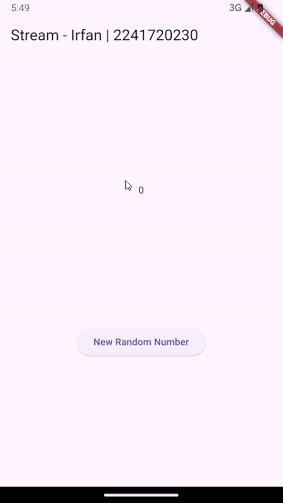

### Langkah 13: Buka stream.dart
Tambahkan method berikut ini.
```dart
  addError() {
    controller.sink.addError('Error');
  }
```

### Langkah 14: Buka main.dart
Tambahkan method onError di dalam class StreamHomePageState pada method listen di fungsi initState() seperti berikut ini.
```dart
  @override
  void initState() {
    numberStream = NumberStream();
    numberStreamController = numberStream.controller;
    Stream stream = numberStreamController.stream;

    stream.listen((event) {
      setState(() {
        lastNumber = event;
      });
    }).onError((error) {
      setState(() {
        lastNumber = -1;
      });
    });
    super.initState();
  }
```

### Langkah 15: Edit method addRandomNumber()
Lakukan comment pada dua baris kode berikut, lalu ketik kode seperti berikut ini.


### `Soal 7`
Jelaskan maksud kode langkah 13 sampai 15 tersebut!
> Maksud dari kode langkah 13 sampai 15 adalah untuk menambahkan error ke dalam stream yang dihasilkan. Error tersebut akan ditambahkan ke dalam sink yang ada pada stream yang dihasilkan.

Kembalikan kode seperti semula pada Langkah 15, comment addError() agar Anda dapat melanjutkan ke praktikum 3 berikutnya.
Lalu lakukan commit dengan pesan "W12: Jawaban Soal 7".

> 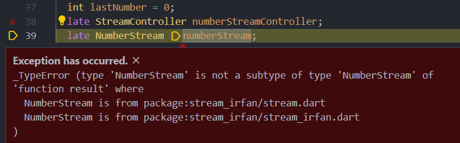

> 


## Praktikum 3: Injeksi data ke streams

--- 

### Langkah 1: Buka main.dart
Menambahkan variabel StreamTransformer
```dart
  late StreamTransformer transformer;
```

### Langkah 2: Tambahkan kode ini di initState
```dart
    transformer = StreamTransformer<int, int>.fromHandlers(
      handleData: (value, sink) {
        sink.add(value);
      },
      handleError: (error, stackTrace, sink) {
        sink.add(-1);
      },
      handleDone: (sink) => sink.close(),
    );
```
### Langkah 3: Tetap di initState
Mengubah bagian streamController
```dart
    stream.transform(transformer).listen((event) {
      setState(() {
        lastNumber = event;
      });
    }).onError((error) {
      setState(() {
        lastNumber = -1;
      });
    });
    super.initState();
```
### Langkah 4: Run
Menjalankan aplikasi

> 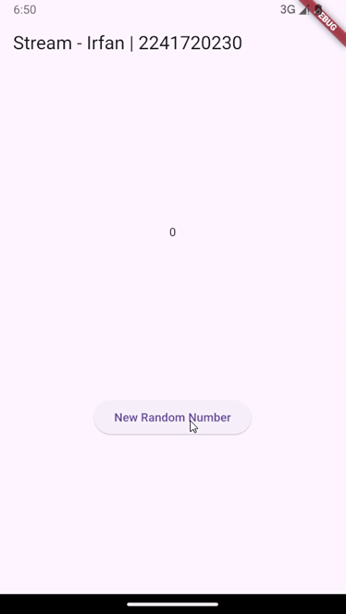

### `Soal 8`
Jelaskan maksud kode langkah 1-3 tersebut!
Capture hasil praktikum Anda berupa GIF dan lampirkan di README.

> Langkah 1 adalah untuk menambahkan variabel StreamTransformer yang digunakan untuk mengubah data yang diterima dari stream.

> Langkah 2 adalah untuk menginisialisasi variabel StreamTransformer yang telah didefinisikan sebelumnya.

> Langkah 3 adalah untuk mengubah bagian streamController yang digunakan untuk mengontrol stream yang dihasilkan.


## Praktikum 4: Subscribe ke stream events

--- 

### Langkah 1: Tambah variabel
Menambahkan variabel StreamSubscription di class _StreamHomePageState

### Langkah 2: Edit initState()
```dart
  @override
  void initState() {
    numberStream = NumberStream();
    numberStreamController = numberStream.controller;
    Stream stream = numberStreamController.stream;
    subscription = stream.listen((event) {
      setState(() {
        lastNumber = event;
      });
    });
    super.initState();
  }
```
### Langkah 3: Tetap di initState()
Menambahkan kode handle Error
```dart
    subscription.onError((error) {
      setState(() {
        lastNumber = -1;
      });
    });
```
### Langkah 4: Tambah properti onDone()
Menambahkan properti onDone()
```dart
    subscription.onDone(() {
      print('OnDone was called');
    });
    super.initState();
```
### Langkah 5: Tambah method baru
Menambahkan method stopStream()
```dart
  void stopStream() {
    numberStreamController.close();
  }
```
### Langkah 6: Pindah ke method dispose()
Menambahkan subscribe.cancel() ke dalam method dispose()
```dart
  @override
  void dispose() {
    numberStreamController.close();
    subscription.cancel();
    super.dispose();
  }
```
### Langkah 7: Pindah ke method build()
Menambahkan button kedua yaitu stopStream()
```dart
  @override
  Widget build(BuildContext context) {
    return Scaffold(
        appBar: AppBar(
          title: const Text('Stream - Irfan | 2241720230'),
        ),
        body: SizedBox(
          width: double.infinity,
          child: Column(
            mainAxisAlignment: MainAxisAlignment.spaceEvenly,
            crossAxisAlignment: CrossAxisAlignment.center,
            children: [
              Text(lastNumber.toString()),
              ElevatedButton(
                  onPressed: () => addRandomNumber(),
                  child: const Text('New Random Number')),
              ElevatedButton(
                  onPressed: () => stopStream(),
                  child: const Text('Stop Subscription')),
            ],
          ),
        ));
  }
```
### Langkah 8: Edit method addRandomNumber()
```dart
  void addRandomNumber() {
    Random random = Random();
    int myNum = random.nextInt(10);
    if (!numberStreamController.isClosed) {
      numberStream.addNumberToSink(myNum);
    } else {
      setState(() {
        lastNumber = -1;
      });
    }
  }
```
### Langkah 9: Run
Menjalankan aplikasi jawaban pada soal

### Langkah 10: Tekan button Stop Subscription
Maka akan muncul tulisan 'OnDone was called'
> 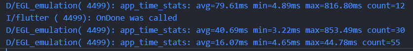

### `Soal 9`
Jelaskan maksud kode langkah 2, 6 dan 8 tersebut!
Capture hasil praktikum Anda berupa GIF dan lampirkan di README.

> Langkah 2 adalah untuk menginisialisasi variabel StreamSubscription yang digunakan untuk melakukan subscribe ke stream yang dihasilkan
> Langkah 6 adalah untuk menambahkan kode untuk mengcancel subscribe ketika widget di dispose atau ketika aplikasi dihentikan
> Langkah 8 adalah untuk menambahkan angka random dari 0-9 ke dalam stream yang dihasilkan. Angka random tersebut akan ditambahkan ke dalam sink yang ada pada stream yang dihasilkan.

> 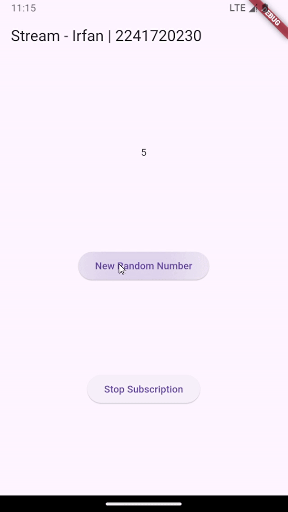

## Praktikum 5: Multiple stream subscriptions

---

### Langkah 1: Buka file main.dart
Menambahkan variabel StreamSubscription dan String values
```dart
  late StreamSubscription subscription;
  String values = '';
```
### Langkah 2: Edit initState()
```dart
    subscription = stream.listen((event) {
      setState(() {
        values += '$event - ';
      });
    });
    subscription2 = stream.listen((event) {
      setState(() {
        values += '$event - ';
      });
    });
```
### Langkah 3: Run
Akan terjadi error saat dijalankan
> 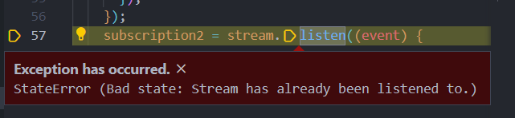

### `Soal 10`
Jelaskan mengapa error itu bisa terjadi ?
> Error terjadi karena stream yang dihasilkan hanya bisa di-subscribe satu kali. Ketika stream tersebut di-subscribe lebih dari satu kali, maka akan terjadi error.

### Langkah 4: Set broadcast stream
Mengubah stream yang dihasilkan menjadi broadcast stream
> 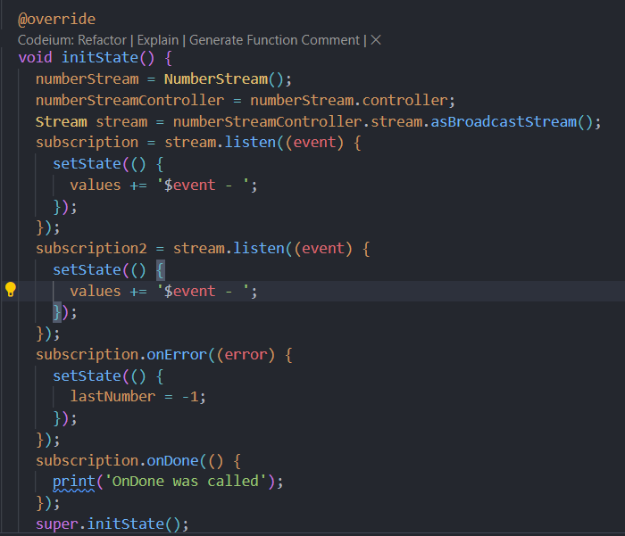

### Langkah 5: Edit method build()
Memasukkan variabel values ke dalam Text()
```dart
body: SizedBox(
          width: double.infinity,
          child: Column(
            mainAxisAlignment: MainAxisAlignment.spaceEvenly,
            crossAxisAlignment: CrossAxisAlignment.center,
            children: [
              Text(values),
              ElevatedButton(
                  onPressed: () => addRandomNumber(),
                  child: const Text('New Random Number')),
              ElevatedButton(
                  onPressed: () => stopStream(),
                  child: const Text('Stop Subscription')),
            ],
          ),
        );
```

### Langkah 6: Run
Menjalankan aplikasi jawaban pada soal

### `Soal 11`
Jelaskan mengapa hal itu bisa terjadi ?
Capture hasil praktikum Anda berupa GIF dan lampirkan di README.

> Hal itu bisa terjadi karena stream yang dihasilkan telah diubah menjadi broadcast stream. Broadcast stream memungkinkan stream yang dihasilkan dapat di-subscribe lebih dari satu kali dan teks akan ditambahkan setiap kali tombol Add Random Number ditekan.

> 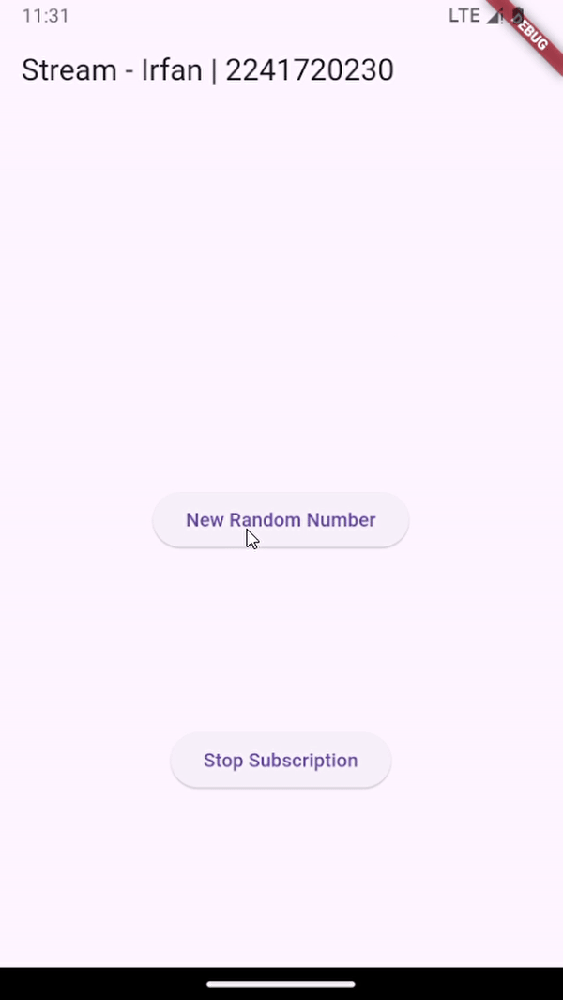


### Praktikum 6: StreamBuilder

--- 

### Langkah 1: Buat Project Baru
Membuat projek baru dengan nama streambuilder_irfan  

### Langkah 2: Buat file baru stream.dart
Membuat class NumberStream

### Langkah 3: Tetap di file stream.dart
Membuat method getNumbers() dengan async*.
```dart
import 'dart:math';

class NumberStream {
  Stream<int> getNumbers() async* {
    yield* Stream.periodic(const Duration(seconds: 1), (int t) {
      Random random = Random();
      int myNum = random.nextInt(10);
      return myNum;
    });
  }
}
```

### Langkah 4: Edit main.dart
```dart
import 'package:flutter/material.dart';
import 'stream_irfan.dart';
import 'dart:async';

void main() {
  runApp(const MyApp());
}

class MyApp extends StatelessWidget {
  const MyApp({Key? key}) : super(key: key);

  // This widget is the root of your application.
  @override
  Widget build(BuildContext context) {
    return MaterialApp(
      title: 'Flutter Demo',
      theme: ThemeData(
        primarySwatch: Colors.deepPurple,
      ),
      home: const StreamHomePage(),
    );
  }
}

class StreamHomePage extends StatefulWidget {
  const StreamHomePage({super.key});

  @override
  State<StreamHomePage> createState() => _StreamHomePageState();
}

class _StreamHomePageState extends State<StreamHomePage> {
  @override
  Widget build(BuildContext context) {
    return Scaffold(
      appBar: AppBar(
        title: const Text('Stream - Irfan | 2241720230'),
      ),
      body: Container(),
    );
  }
}
```

### Langkah 5: Tambah variabel
Meambahkan variabel late Stream.

### Langkah 6: Edit initState()
```dart
  @override
  void initState() {
    numberStream = NumberStream().getNumbers();
    super.initState();
  }
```

### Langkah 7: Edit method build()
Menampilkan hasil stream yang dihasilkan.
```dart
 @override
  Widget build(BuildContext context) {
    return Scaffold(
      appBar: AppBar(
        title: const Text('Stream - Irfan | 2241720230'),
      ),
      body: StreamBuilder(
          stream: numberStream,
          initialData: 0,
          builder: (context, snapshot) {
            if (snapshot.hasError) {
              print('Error!');
            }
            if (snapshot.hasData) {
              return Center(
                  child: Text(
                snapshot.data.toString(),
                style: const TextStyle(fontSize: 96),
              ));
            } else {
              return const SizedBox.shrink();
            }
          }),
    );
  }
```

### Langkah 8: Run
Menjalankan aplikasi

> 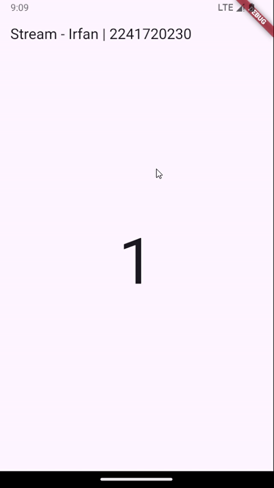

### `Soal 12`
Jelaskan maksud kode pada langkah 3 dan 7 !
Capture hasil praktikum Anda berupa GIF dan lampirkan di README.
Jawaban
> Langkah 3 adalah untuk membuat method getNumbers() yang digunakan untuk menghasilkan stream yang berisi list angka random dari 0-9.

> Langkah 7 adalah untuk menampilkan hasil stream yang dihasilkan ke dalam aplikasi menggunakan StreamBuilder.

## Praktikum 7: BLoC Pattern

--- 

### Langkah 1: Buat Project baru
Membuat projek baru dengan nama bloc_random_edo dengan menggunakan perintah flutter create bloc_random_edo -e. lalu membuat file baru dengan nama random_bloc.dart di dalam folder lib.

### Langkah 2: Isi kode random_bloc.dart
Import package dart:async dan math

### Langkah 3: Buat class RandomNumberBloc()
Memasukkan kode class RandomNumberBloc() di dalam file random_bloc.dart

### Langkah 4: Buat variabel StreamController
Menambahkan variabel StreamController di class RandomNumberBloc()

### Langkah 5: Buat constructor
Menambahkan constructor di class RandomNumberBloc()

### Langkah 6: Buat method dispose()
Menambahkan method dispose() di class RandomNumberBloc()
```dart
import 'dart:async';
import 'dart:math';

class RandomNumberBloc {
  final _generateRandomController = StreamController<void>();
  final _randomNumberController = StreamController<int>();
  Sink<void> get generateRandom => _generateRandomController.sink;
  Stream<int> get randomNumber => _randomNumberController.stream;

  RandomNumberBloc() {
    _generateRandomController.stream.listen((_) {
      final random = Random().nextInt(100);
      _randomNumberController.sink.add(random);
    });
  }

  void dispose() {
    _generateRandomController.close();
    _randomNumberController.close();
  }
}

```

### Langkah 7: Edit main.dart
```dart
import 'package:bloc_random_irfan/random_screen.dart';
import 'package:flutter/material.dart';

void main() {
  runApp(const MyApp());
}

class MyApp extends StatelessWidget {
  const MyApp({super.key});

  @override
  Widget build(BuildContext context) {
    return MaterialApp(
      title: 'Flutter Demo',
      theme: ThemeData(
        primarySwatch: Colors.blue,
      ),
      home: const RandomScreen(),
    );
  }
}
```

### Langkah 8: Buat file baru random_screen.dart
Membuat file baru dengan nama random_screen.dart di dalam folder lib.

### Langkah 9: Lakukan impor material dan random_bloc.dart
Import package material dan random_bloc.dart

### Langkah 10: Buat StatefulWidget RandomScreen
Membuat class RandomScreen yang merupakan StatefulWidget

### Langkah 11: Buat variabel
Menambahkan variabel RandomNumberBloc di dalam class _RandomScreenState

### Langkah 12: Buat method dispose()
Menambahkan method dispose() di dalam class _RandomScreenState

### Langkah 13: Edit method build()
```dart
@override
  Widget build(BuildContext context) {
    return Scaffold(
      appBar: AppBar(
        title: const Text('Random Number - Irfan | 2241720230'),
      ),
      body: Center(
        child: StreamBuilder(
          stream: _bloc.randomNumber,
          initialData: 0,
          builder: (context, snapshot) {
            return Text(
              'Random Number: ${snapshot.data}',
              style: const TextStyle(fontSize: 24),
            );
          },
        ),
      ),
      floatingActionButton: FloatingActionButton(
        onPressed: () => _bloc.generateRandom.add(null),
        child: const Icon(Icons.refresh),
      ),
    );
  }
```

### `Soal 13`
Jelaskan maksud praktikum ini ! Dimanakah letak konsep pola BLoC-nya ?
Capture hasil praktikum Anda berupa GIF dan lampirkan di README.

> Maksud dari praktikum ini adalah untuk membuat aplikasi yang menggunakan pola BLoC. Pola BLoC adalah pola yang digunakan untuk memisahkan antara logika bisnis dan tampilan. Konsep pola BLoC terletak pada class RandomNumberBloc() yang digunakan untuk mengatur stream yang dihasilkan. setiap perubahan pada stream akan diatur oleh class RandomNumberBloc() dan akan ditampilkan ke dalam aplikasi menggunakan StreamBuilder.


> 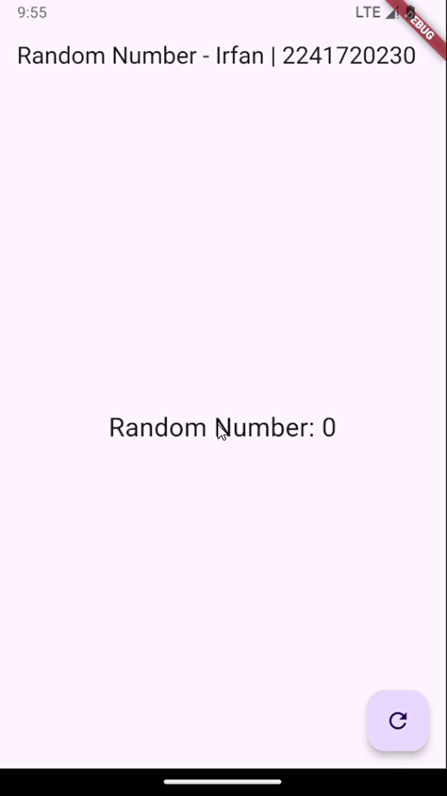
